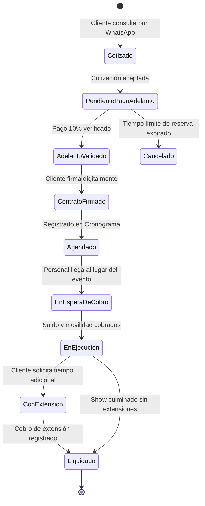

# 04. Matriz de Reglas de Negocio y Procesos de Control

---

## 1. Reglas de Negocio del Sistema (RN)

### RN-01: Estructura de la Cotización Económica
El precio final a cobrar al cliente se determina de acuerdo con la fórmula:
$$\text{Total Cotizado} = \text{Precio Paquete Base} + \sum_{i=1}^{n} \text{Precio Extra}_i + \text{Costo Movilidad}$$
* Los precios de los paquetes y de los extras se encuentran tabulados en el catálogo del sistema.
* La movilidad se calcula de forma independiente y se suma al consolidado final.

---

### RN-02: Determinación del Adelanto y Saldo Pendiente
Para mitigar el riesgo de cancelación sin sobrecargar financieramente al cliente al momento de reservar:
$$\text{Monto Adelanto (10%)} = 0.10 \times \left( \text{Precio Paquete Base} + \sum_{i=1}^{n} \text{Precio Extra}_i \right)$$
$$\text{Saldo Pendiente} = \text{Total Cotizado} - \text{Monto Adelanto}$$
> **Importante:** La movilidad no se incluye dentro de la base de cálculo del 10% del adelanto. El costo íntegro de la movilidad se liquida el día del evento como parte del saldo pendiente.

---

### RN-03: Cálculo de Movilidad con Margen Comercial
1. La movilidad cubre el desplazamiento de **ida y vuelta** del personal y equipos desde la base de operaciones hasta el lugar del evento.
2. La distancia ($D$) en kilómetros y la duración ($T$) en minutos son calculadas mediante la API de Google Maps.
3. Se aplica un recargo comercial de seguridad del **15%**:
$$\text{Movilidad Base} = f(D_{\text{ida+vuelta}}, T_{\text{ida+vuelta}})$$
$$\text{Costo Movilidad} = \text{Movilidad Base} \times 1.15$$
4. **Excepción de Transporte del Cliente:** Si el cliente opta por brindar movilidad propia de ida y vuelta para el elenco, el costo de movilidad se fija en **S/. 0.00**.

---

### RN-04: Disponibilidad de Recursos y Aprobación por Umbral
1. La disponibilidad de un show u hora loca depende de la conformación de grupos con el personal freelance registrado y activo.
2. La disponibilidad de servicios de decoración y toldos depende estrictamente del stock de inventario disponible en esa fecha y horario.
3. **Umbral de Concurrencia:** 
   * Si en una misma fecha y bloque horario existen **$\le 3$ shows**, la asignación y pre-reserva es automática.
   * Si se reciben solicitudes para **$> 3$ shows simultáneos**, el sistema bloquea la confirmación automática y exige la **aprobación manual expresa** de un encargado.

---

### RN-05: Intervalo Obligatorio de Tránsito entre Shows Sucesivos
Para un mismo grupo de artistas asignado a múltiples presentaciones en el mismo día:
$$\text{Intervalo Mínimo} = \text{Tiempo de Tránsito (Google Maps)} + \text{Margen de Desarme y Descanso (30 min)}$$
* Si el intervalo entre el fin del Evento $A$ y el inicio del Evento $B$ es menor al intervalo mínimo, el sistema alerta sobre solapamiento y rechaza la asignación automática, derivando el caso a revisión del encargado.

---

### RN-06: Condición Sine Qua Non de Inicio del Show
* **Ningún show, armado de toldo ni ambientación puede dar inicio sin que se haya cobrado el 100% del saldo pendiente (saldo de servicios + movilidad).**
* El personal del elenco o encargado en sitio debe registrar el cobro (vía Yape, transferencia o efectivo) para habilitar el cambio de estado a «En Ejecución».

---

### RN-07: Extensiones de Show y Liquidación Post-Evento
* Si el cliente solicita prolongar la duración del show o mantener tiempo de espera durante el evento, la tarifa adicional por hora o fracción debe registrarse como «Extensión en Vivo».
* Este concepto se añade a la liquidación final antes de marcar el evento como «Liquidado».

---

### RN-08: Cálculo de Utilidad Neta y Costos Fijos
La rentabilidad del negocio se audita comparando los ingresos reales contra los costos directos fijos:
$$\text{Utilidad Neta} = \text{Ingresos Totales Liquidados} - \left( \sum \text{Costo Fijo Paquetes} + \sum \text{Costo Fijo Extras} + \text{Costos Operativos de Movilidad} \right)$$
* Los costos asignados a cada paquete y extra representan las tarifas fijas acordadas con el elenco freelance, DJ y armadores.

---

## 2. Matriz de Procesos de Control y Sobrescritura (*Overrides*)

| # | Proceso de Control | Tipo | Condición de Activación | Mecanismo de Control |
| :-: | :--- | :--- | :--- | :--- |
| **PC-01** | **Verificación de Recursos** | Automático | Al cotizar fecha y hora | Cruce contra agenda de personal e inventario físico de toldos/decoración. |
| **PC-02** | **Ajuste de Intervalos** | Híbrido | Tránsito entre shows del mismo elenco | El sistema sugiere tiempo de tránsito por Google Maps; el encargado tiene facultad de editar el intervalo. |
| **PC-03** | **Umbral de Shows Simultáneos** | Manual | Eventos simultáneos $> 3$ | Notificación al encargado con panel de aprobación o rechazo manual. |
| **PC-04** | **Override de Movilidad** | Manual | Previa emisión de cotización/contrato | El encargado puede modificar a criterio el monto sugerido de movilidad. |
| **PC-05** | **Modo Manual de Contrato** | Manual | A requerimiento del administrador | Formulario administrativo para armar contratos omitiendo el bot de WhatsApp. |
| **PC-06** | **Validación de Pagos con Reintento** | Híbrido | Al subir captura de comprobante | Si el comprobante es inválido, el sistema envía recordatorio y habilita reintento sin cancelar la cotización. |
| **PC-07** | **Control de Inicio de Show** | Operativo | Llegada del personal a locación | Bloqueo del inicio del servicio hasta validar cobro del saldo restante. |
| **PC-08** | **Liquidación de Horas Extra** | Operativo | Al finalizar el show | Registro formal de montos por tiempo adicional previo al cierre del evento. |
| **PC-09** | **Trazabilidad Contable Fija** | Automático | Cierre semanal y mensual | Uso de costos fijos precargados para asegurar reportes contables auditables. |
| **PC-10** | **Persistencia de Observaciones** | Estructural | Registro de cotización y contrato | Almacenamiento en campo específico visible en PDF y cronograma para evitar extravíos. |

---

## 3. Máquina de Estados del Evento y del Contrato

### 3.1 Ciclo de Vida del Evento

### 3.2 Ciclo de Vida del Contrato
* `BORRADOR`: Creado automáticamente tras calcular cotización o generado en modo manual.
* `EMITIDO_PENDIENTE_FIRMA`: PDF compilado y enviado con enlace de firma digital.
* `FIRMADO`: Sellado digitalmente con firma del cliente y metadatos de validación.
* `ANULADO`: En caso de rechazo del adelanto o cancelación del evento antes de su ejecución.
