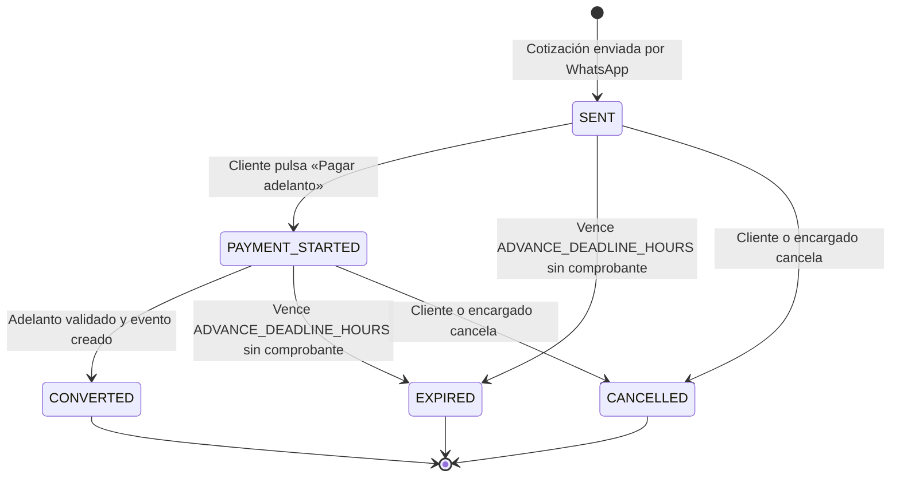
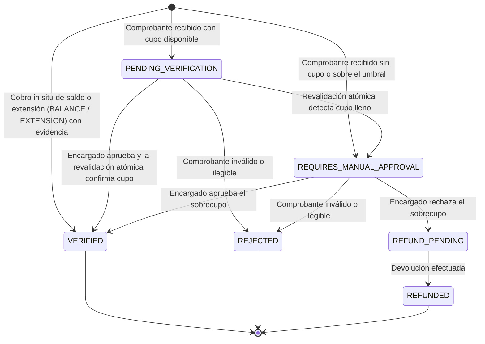
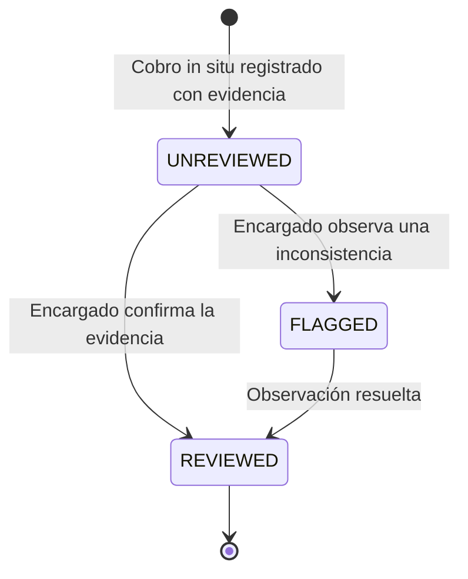
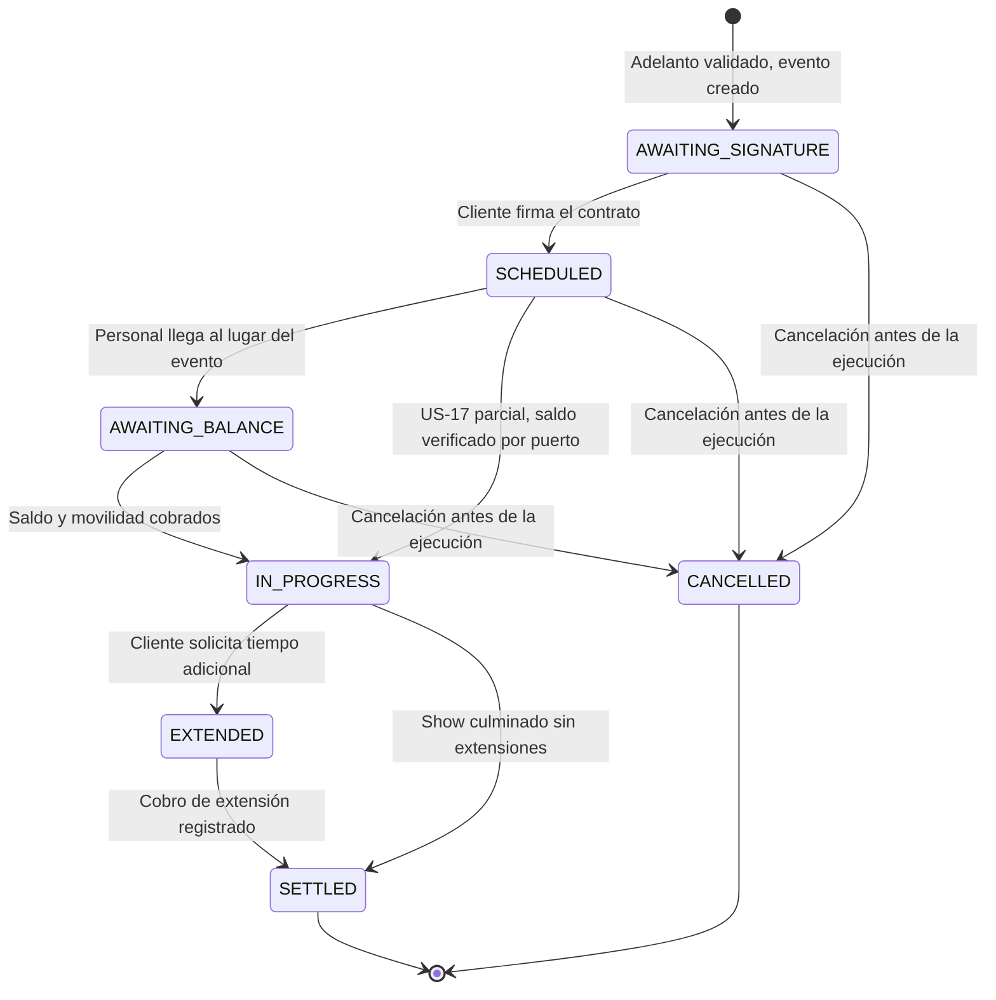
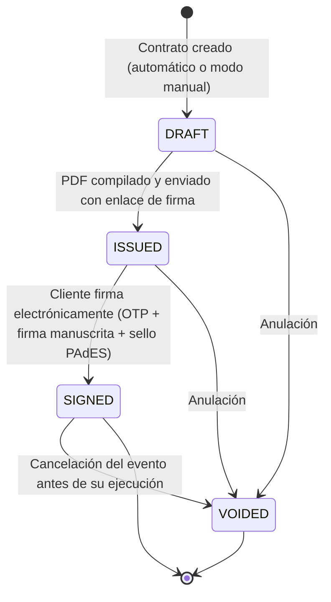

# 04. Matriz de Reglas de Negocio y Procesos de Control

---

## 1. Reglas de Negocio del Sistema (RN)

### RN-01: Estructura de la Cotización Económica
El precio final a cobrar al cliente se determina de acuerdo con la fórmula:
$$\text{Total Cotizado} = \text{Precio Paquete Base} + \sum_{i=1}^{n} \text{Precio Extra}_i + \text{Costo Movilidad}$$
* Los precios de los paquetes y de los extras se encuentran tabulados en el catálogo del sistema.
* La movilidad se calcula de forma independiente y se suma al consolidado final.

---

### RN-02: Determinación del Adelanto y Saldo Pendiente
Para mitigar el riesgo de cancelación sin sobrecargar financieramente al cliente al momento de reservar:
$$\text{Monto Adelanto (10%)} = 0.10 \times \left( \text{Precio Paquete Base} + \sum_{i=1}^{n} \text{Precio Extra}_i \right)$$
$$\text{Saldo Pendiente} = \text{Total Cotizado} - \text{Monto Adelanto}$$
> **Importante:** La movilidad no se incluye dentro de la base de cálculo del 10% del adelanto. El costo íntegro de la movilidad se liquida el día del evento como parte del saldo pendiente.

---

### RN-03: Cálculo de Movilidad con Margen Comercial
1. La movilidad cubre el desplazamiento de **ida y vuelta** del personal y equipos desde la base de operaciones hasta el lugar del evento.
2. La distancia ($D$) en kilómetros y la duración ($T$) en minutos son calculadas mediante la API de Google Maps.
3. Se aplica un recargo comercial de seguridad del **15%**:
$$\text{Movilidad Base} = f(D_{\text{ida+vuelta}}, T_{\text{ida+vuelta}})$$
$$\text{Costo Movilidad} = \text{Movilidad Base} \times 1.15$$
4. **Excepción de Transporte del Cliente:** Si el cliente opta por brindar movilidad propia de ida y vuelta para el elenco, el costo de movilidad se fija en **S/. 0.00**.

---

### RN-04: Disponibilidad de Recursos y Aprobación por Umbral
1. La disponibilidad de un show u hora loca depende de la conformación de grupos con el personal freelance registrado y activo.
2. La disponibilidad de servicios de decoración y toldos depende estrictamente del stock de inventario disponible en esa fecha y horario.
3. **Simultaneidad por solapamiento real de intervalos:** dos shows son simultáneos cuando sus intervalos $[\text{inicio}, \text{fin})$ se solapan, con $\text{fin} = \text{inicio} + \text{duración del paquete}$. No se utilizan bloques horarios fijos.
4. **Eventos que cuentan para el umbral:** solo los eventos con adelanto validado y que no estén en estado `CANCELLED`. Las cotizaciones sin adelanto validado no reservan cupo y no cuentan.
5. **Umbral de Concurrencia** (`SIMULTANEOUS_SHOWS_THRESHOLD`, por defecto `3`):
   * Si, al incorporar el show solicitado, la cantidad de shows simultáneos es **$\le 3$**, la asignación es automática.
   * Si la cantidad **supera 3** (el show solicitado sería el cuarto simultáneo), el sistema bloquea la confirmación automática y exige la **aprobación manual expresa** de un encargado.
6. **La aprobación manual es un estado del pago** (`REQUIRES_MANUAL_APPROVAL`), no una bandera del evento. El encargado puede aprobar el sobrecupo (el pago pasa a `VERIFIED`) o rechazarlo (el pago pasa a `REFUND_PENDING`).

---

### RN-05: Intervalo Obligatorio de Tránsito entre Shows Sucesivos
Para un mismo grupo de artistas asignado a múltiples presentaciones en el mismo día:
$$\text{Intervalo Mínimo} = \text{Tiempo de Tránsito (Google Maps)} + \text{Margen de Desarme y Descanso (30 min)}$$
* Si el intervalo entre el fin del Evento $A$ y el inicio del Evento $B$ es menor al intervalo mínimo, el sistema alerta sobre solapamiento y rechaza la asignación automática, derivando el caso a revisión del encargado.

---

### RN-06: Condición Sine Qua Non de Inicio del Show
* **Ningún show, armado de toldo ni ambientación puede dar inicio sin que se haya cobrado el 100% del saldo pendiente (saldo de servicios + movilidad).**
* El personal del elenco o encargado en sitio debe registrar el cobro (vía Yape, transferencia o efectivo) para habilitar el cambio de estado del evento a `IN_PROGRESS` («En ejecución»).
* **Registro directo con evidencia:** el cobro se registra in situ como un pago de concepto `BALANCE` directamente en `VERIFIED`, con evidencia obligatoria (medio de pago y fotografía de la pantalla de Yape/Plin o del efectivo recibido), para que el show nunca quede bloqueado esperando a un encargado. El encargado lo audita después (ver sección 3.2).

---

### RN-07: Extensiones de Show y Liquidación Post-Evento
* Si el cliente solicita prolongar la duración del show o mantener tiempo de espera durante el evento, la tarifa adicional por hora o fracción debe registrarse como «Extensión en Vivo».
* Este concepto se añade a la liquidación final antes de marcar el evento como `SETTLED` («Liquidado»).
* Como el saldo pre-show, la extensión se registra como un pago de concepto `EXTENSION` directamente en `VERIFIED`, con evidencia obligatoria (medio de pago y fotografía), y queda sujeta a auditoría posterior del encargado.

---

### RN-08: Cálculo de Utilidad Neta y Costos Fijos
La rentabilidad del negocio se audita comparando los ingresos reales contra los costos directos fijos:
$$\text{Utilidad Neta} = \text{Ingresos Totales Liquidados} - \left( \sum \text{Costo Fijo Paquetes} + \sum \text{Costo Fijo Extras} + \text{Costos Operativos de Movilidad} \right)$$
* Los costos asignados a cada paquete y extra representan las tarifas fijas acordadas con el elenco freelance, DJ y armadores.

---

### RN-09: Plazo del Adelanto, Vigencia de la Cotización y Revalidación de Disponibilidad
1. **Plazo del adelanto:** la cotización tiene una vigencia de `ADVANCE_DEADLINE_HOURS` horas (por defecto `24`) contadas desde su envío al cliente. Si vence el plazo sin que se reciba un comprobante, la cotización pasa a `EXPIRED`. Una cotización con comprobante ya recibido no vence mientras el pago esté en verificación.
2. **Sin reserva previa:** una cotización sin adelanto validado **no reserva cupo**. El cupo solo queda asegurado cuando el adelanto es validado y se crea el evento.
3. **Mensaje de cotización:** no contiene datos de pago. Advierte que la fecha y el horario solo quedan asegurados tras la validación del adelanto, informa el plazo y ofrece el botón «Pagar adelanto».
4. **Revalidación al pulsar «Pagar adelanto»:** si han transcurrido más de `AVAILABILITY_RECHECK_MINUTES` minutos (por defecto `60`) desde el envío de la cotización, el bot revalida la disponibilidad antes de mostrar los datos de Yape, Plin o cuenta bancaria. Si hay cupo, muestra los datos de pago y la cotización pasa a `PAYMENT_STARTED`. Si no hay cupo, ofrece otra fecha u horario o derivar la conversación a un encargado, y no revela datos de pago.
5. **Revalidación temprana al subir el comprobante:** si el cupo ya no está disponible, el pago ingresa en `REQUIRES_MANUAL_APPROVAL` en lugar de `PENDING_VERIFICATION` (alerta temprana, no autoritativa).
6. **Revalidación autoritativa al validar el pago:** se ejecuta de forma atómica bajo bloqueo distribuido (Redis lock, ADR-06) antes de confirmar. Si el cupo está lleno, el encargado decide: aprobar el sobrecupo (el pago pasa a `VERIFIED`) o rechazar (el pago pasa a `REFUND_PENDING` y luego a `REFUNDED` al efectuarse la devolución).

---

### RN-10: Atención de Conversaciones: Bot o Encargado
1. Toda conversación de WhatsApp tiene un solo responsable a la vez, según su `status` en el gateway de mensajería (Chatwoot, ADR-10): en `pending` responde el **bot** (modo `BOT`); en `open` atiende un **encargado** (modo `HUMAN`) y el bot **no responde**. Una conversación `resolved` se trata como modo `BOT`: si el cliente vuelve a escribir, se reabre en `pending`.
2. La conversación pasa a `open` por tres disparadores: el cliente pide hablar con un encargado, el bot no entiende dos veces consecutivas, o un encargado la toma manualmente. Una excepción no controlada del bot también la deriva automáticamente. Cada derivación registra su motivo (`handoff_reason`, ver sección 3.5) y un resumen (`handoff_summary`).
3. Una conversación `open` sin encargado asignado es una **derivación pendiente de toma**. Solo el encargado asignado puede escribir en ella; otro `ENCARGADO` no puede tomarla, pero un `SUPERADMIN` puede reasignarla a sí mismo, con registro en `audit_logs`.
4. El encargado asignado, o un `SUPERADMIN`, devuelve la conversación al bot con `release`; el bot retoma las respuestas.
5. **Las decisiones de negocio** (aprobación del adelanto, sobrecupo, rechazo de comprobante) se toman únicamente en el panel de EventPro, no desde la conversación.
6. Chatwoot es la fuente de verdad de los mensajes; EventPro no los almacena y solo conserva el vínculo de negocio en `conversation_links`.

---

### RN-11: Ventana de Servicio de 24 Horas
1. La ventana de servicio de WhatsApp está **abierta** mientras no hayan transcurrido 24 horas desde el último mensaje entrante del cliente; vence a las 24 horas de ese mensaje.
2. Con la ventana abierta, el encargado y el bot responden con **texto libre** (o adjuntos). Con la ventana cerrada solo se pueden enviar **plantillas aprobadas**; un texto libre se rechaza (`service-window-closed`).
3. Para contener costos (precios de Meta vigentes desde 2026-10-01) se permanece en el número de prueba y las plantillas se reservan para mensajes fuera de la ventana (por ejemplo, el OTP de firma).
4. La bandeja indica en todo momento si la ventana está abierta y cuándo vence.

---

## 2. Matriz de Procesos de Control y Sobrescritura (*Overrides*)

| # | Proceso de Control | Tipo | Condición de Activación | Mecanismo de Control |
| :-: | :--- | :--- | :--- | :--- |
| **PC-01** | **Verificación de Recursos** | Automático | Al cotizar fecha y hora | Cruce contra agenda de personal e inventario físico de toldos/decoración. |
| **PC-02** | **Ajuste de Intervalos** | Híbrido | Tránsito entre shows del mismo elenco | El sistema sugiere tiempo de tránsito por Google Maps; el encargado tiene facultad de editar el intervalo. |
| **PC-03** | **Umbral de Shows Simultáneos** | Manual | Solapamiento real de intervalos $[\text{inicio}, \text{fin})$ con más de `SIMULTANEOUS_SHOWS_THRESHOLD` (3) eventos con adelanto validado y no cancelados | El pago pasa a `REQUIRES_MANUAL_APPROVAL`; notificación al encargado con panel de aprobación o rechazo manual. |
| **PC-04** | **Override de Movilidad** | Manual | Previa emisión de cotización/contrato | El encargado puede modificar a criterio el monto sugerido de movilidad. |
| **PC-05** | **Modo Manual de Contrato** | Manual | A requerimiento del administrador | Formulario administrativo para armar contratos omitiendo el bot de WhatsApp. |
| **PC-06** | **Validación de Pagos con Reintento** | Híbrido | Al subir captura de comprobante | Si el comprobante es inválido, el sistema envía recordatorio y habilita reintento sin cancelar la cotización. |
| **PC-07** | **Control de Inicio de Show** | Operativo | Llegada del personal a locación | Bloqueo del inicio del servicio hasta registrar el cobro del saldo restante con evidencia (medio y fotografía). |
| **PC-08** | **Liquidación de Horas Extra** | Operativo | Al finalizar el show | Registro formal de montos por tiempo adicional, con evidencia, previo al cierre del evento. |
| **PC-09** | **Trazabilidad Contable Fija** | Automático | Cierre semanal y mensual | Uso de costos fijos precargados para asegurar reportes contables auditables. |
| **PC-10** | **Persistencia de Observaciones** | Estructural | Registro de cotización y contrato | Almacenamiento en campo específico visible en PDF y cronograma para evitar extravíos. |
| **PC-11** | **Revalidación de Disponibilidad y Vencimiento de Adelanto** | Automático | Al pulsar «Pagar adelanto» (más de `AVAILABILITY_RECHECK_MINUTES`), al subir comprobante y al validar el pago; y al vencer `ADVANCE_DEADLINE_HOURS` | Revalidación con bloqueo distribuido (Redis lock) en la validación; la cotización pasa a `EXPIRED` al vencer el plazo; si no hay cupo se ofrece otro horario o derivación al encargado. |
| **PC-12** | **Auditoría Posterior de Cobros In Situ** | Manual | Pago `BALANCE` o `EXTENSION` registrado con evidencia | El pago nace `VERIFIED` con `audit_status = UNREVIEWED`; el encargado lo marca `REVIEWED` o `FLAGGED` (con observaciones) sin bloquear la operación. |
| **PC-13** | **Traspaso de Conversación a Encargado** | Híbrido | El cliente pide un encargado, el bot no entiende dos veces seguidas, el bot falla (`BOT_ERROR`) o un encargado toma la conversación | La conversación pasa a `open` (modo `HUMAN`) y el bot deja de responder; aviso en tiempo real en la bandeja; el encargado devuelve la conversación al bot con `release`. |

---

## 3. Máquinas de Estados

El sistema maneja **cuatro ciclos de vida independientes**: cotización, pago, evento y contrato (más la auditoría posterior de los cobros in situ, un atributo del pago). Las conversaciones de WhatsApp no tienen un ciclo propio en EventPro: su `status` lo gestiona Chatwoot y EventPro lo proyecta a un modo de atención (ver sección 3.5). Los códigos de estado son identificadores en inglés (`UPPER_SNAKE_CASE`) y se usan tal cual en el código, en las restricciones `CHECK` de la base de datos y en los *payloads* de la API. La etiqueta en español es solo para la interfaz de usuario. **Esta sección es la fuente única de verdad**: los demás documentos deben referenciarla en lugar de duplicarla.

### 3.1 Ciclo de Vida de la Cotización

```mermaid
stateDiagram-v2
    [*] --> SENT: Cotización enviada por WhatsApp
    SENT --> PAYMENT_STARTED: Cliente pulsa «Pagar adelanto»
    SENT --> EXPIRED: Vence ADVANCE_DEADLINE_HOURS sin comprobante
    PAYMENT_STARTED --> CONVERTED: Adelanto validado y evento creado
    PAYMENT_STARTED --> EXPIRED: Vence ADVANCE_DEADLINE_HOURS sin comprobante
    SENT --> CANCELLED: Cliente o encargado cancela
    PAYMENT_STARTED --> CANCELLED: Cliente o encargado cancela
    CONVERTED --> [*]
    EXPIRED --> [*]
    CANCELLED --> [*]
```

### 3.2 Ciclo de Vida del Pago

```mermaid
stateDiagram-v2
    [*] --> PENDING_VERIFICATION: Comprobante recibido con cupo disponible
    [*] --> REQUIRES_MANUAL_APPROVAL: Comprobante recibido sin cupo o sobre el umbral
    [*] --> VERIFIED: Cobro in situ de saldo o extensión (BALANCE / EXTENSION) con evidencia
    PENDING_VERIFICATION --> VERIFIED: Encargado aprueba y la revalidación atómica confirma cupo
    PENDING_VERIFICATION --> REJECTED: Comprobante inválido o ilegible
    PENDING_VERIFICATION --> REQUIRES_MANUAL_APPROVAL: Revalidación atómica detecta cupo lleno
    REQUIRES_MANUAL_APPROVAL --> VERIFIED: Encargado aprueba el sobrecupo
    REQUIRES_MANUAL_APPROVAL --> REFUND_PENDING: Encargado rechaza el sobrecupo
    REQUIRES_MANUAL_APPROVAL --> REJECTED: Comprobante inválido o ilegible
    REFUND_PENDING --> REFUNDED: Devolución efectuada
    VERIFIED --> [*]
    REJECTED --> [*]
    REFUNDED --> [*]
```
> Un pago `REJECTED` permite reintento: el cliente envía un nuevo comprobante y se crea un nuevo registro de pago, sin cancelar la cotización.

> El ciclo completo (verificación por el encargado, sobrecupo, reembolso) aplica al concepto `ADVANCE`. Los pagos `BALANCE` y `EXTENSION` se registran in situ directamente en `VERIFIED` con evidencia obligatoria (método de pago y fotografía) y solo recorren el ciclo de auditoría posterior descrito a continuación.

#### Auditoría posterior (`payments.audit_status`)
Aplica solo a pagos `BALANCE` y `EXTENSION`; en `ADVANCE` el campo es nulo. Es independiente de `validation_status`: marcar un cobro como `FLAGGED` no revierte el pago ni bloquea el evento.

```mermaid
stateDiagram-v2
    [*] --> UNREVIEWED: Cobro in situ registrado con evidencia
    UNREVIEWED --> REVIEWED: Encargado confirma la evidencia
    UNREVIEWED --> FLAGGED: Encargado observa una inconsistencia
    FLAGGED --> REVIEWED: Observación resuelta
    REVIEWED --> [*]
```

### 3.3 Ciclo de Vida del Evento
El evento se crea únicamente cuando el adelanto es validado.

> **US-17 parcial — inicio desacoplado:** `/events/{id}/start` permite iniciar
> directamente desde `SCHEDULED` o `AWAITING_BALANCE` cuando el puerto confirma
> que adelanto + total BALANCE verificado cubren el total final. No basta con
> el saldo almacenado en `events`, no se reciben declaraciones de pago del
> cliente y no existe un estado `CONFIRMED`. La transición registra la hora
> real UTC una sola vez; un reintento devuelve `409`. Llegada, cobro con
> evidencia y auditoría de US-17 siguen pendientes.

```mermaid
stateDiagram-v2
    [*] --> AWAITING_SIGNATURE: Adelanto validado, evento creado
    AWAITING_SIGNATURE --> SCHEDULED: Cliente firma el contrato
    SCHEDULED --> AWAITING_BALANCE: Personal llega al lugar del evento
    SCHEDULED --> IN_PROGRESS: US-17 parcial, saldo verificado por puerto
    AWAITING_BALANCE --> IN_PROGRESS: Saldo y movilidad cobrados
    IN_PROGRESS --> EXTENDED: Cliente solicita tiempo adicional
    EXTENDED --> SETTLED: Cobro de extensión registrado
    IN_PROGRESS --> SETTLED: Show culminado sin extensiones
    AWAITING_SIGNATURE --> CANCELLED: Cancelación antes de la ejecución
    SCHEDULED --> CANCELLED: Cancelación antes de la ejecución
    AWAITING_BALANCE --> CANCELLED: Cancelación antes de la ejecución
    SETTLED --> [*]
    CANCELLED --> [*]
```

### 3.4 Ciclo de Vida del Contrato

```mermaid
stateDiagram-v2
    [*] --> DRAFT: Contrato creado (automático o modo manual)
    DRAFT --> ISSUED: PDF compilado y enviado con enlace de firma
    ISSUED --> SIGNED: Cliente firma electrónicamente (OTP + firma manuscrita + sello PAdES)
    DRAFT --> VOIDED: Anulación
    ISSUED --> VOIDED: Anulación
    SIGNED --> VOIDED: Cancelación del evento antes de su ejecución
    SIGNED --> [*]
    VOIDED --> [*]
```
> Tras una anulación (`VOIDED`) se puede emitir un contrato nuevo para el mismo evento: solo puede existir un contrato no anulado por evento.

### 3.5 Tabla de Mapeo: Código, Etiqueta de Interfaz y Significado

| Ciclo | Código | Etiqueta en la interfaz (español) | Significado |
| :--- | :--- | :--- | :--- |
| Cotización | `SENT` | Cotizado | Cotización enviada al cliente; dentro del plazo de vigencia y sin comprobante. No reserva cupo. |
| Cotización | `PAYMENT_STARTED` | Pago iniciado | El cliente pulsó «Pagar adelanto» y se le mostraron los datos de pago. |
| Cotización | `CONVERTED` | Convertida | El adelanto fue validado y se creó el evento. |
| Cotización | `EXPIRED` | Vencida | Venció `ADVANCE_DEADLINE_HOURS` sin comprobante recibido. |
| Cotización | `CANCELLED` | Cancelada | Cancelada por el cliente o por el encargado antes de convertirse. |
| Pago | `PENDING_VERIFICATION` | Pendiente de verificación | Comprobante recibido y en cola de revisión del encargado. |
| Pago | `REQUIRES_MANUAL_APPROVAL` | Requiere aprobación manual | Cupo lleno o umbral de shows simultáneos superado; el encargado debe decidir. |
| Pago | `VERIFIED` | Verificado | Adelanto validado (habilita la creación del evento) o cobro in situ de saldo/extensión registrado con evidencia. |
| Pago | `REJECTED` | Rechazado | Comprobante inválido o ilegible (desde `PENDING_VERIFICATION` o `REQUIRES_MANUAL_APPROVAL`); se permite reintento con un nuevo pago. |
| Pago | `REFUND_PENDING` | Devolución pendiente | Sobrecupo rechazado; el adelanto debe devolverse al cliente. |
| Pago | `REFUNDED` | Devuelto | Devolución del adelanto efectuada. |
| Auditoría de pago | `UNREVIEWED` | Sin revisar | Cobro in situ (`BALANCE` o `EXTENSION`) pendiente de revisión del encargado. |
| Auditoría de pago | `REVIEWED` | Revisado | El encargado confirmó la evidencia del cobro. |
| Auditoría de pago | `FLAGGED` | Observado | El encargado detectó una inconsistencia; requiere seguimiento. |
| Evento | `AWAITING_SIGNATURE` | Pendiente de firma | Evento creado con adelanto validado; el contrato espera la firma del cliente. |
| Evento | `SCHEDULED` | Agendado | Contrato firmado; evento registrado en el cronograma. |
| Evento | `AWAITING_BALANCE` | En espera de cobro | El personal llegó al lugar; falta cobrar el saldo y la movilidad. |
| Evento | `IN_PROGRESS` | En ejecución | Saldo cobrado al 100%; el show está en curso. |
| Evento | `EXTENDED` | Con extensión | El cliente solicitó tiempo adicional durante el show. |
| Evento | `SETTLED` | Liquidado | Evento cerrado con todos los cobros registrados. |
| Evento | `CANCELLED` | Cancelado | Cancelado desde cualquier estado previo a `IN_PROGRESS`; deja de contar para el umbral de simultaneidad. |
| Contrato | `DRAFT` | Borrador | Creado automáticamente al validar el adelanto o generado en modo manual. |
| Contrato | `ISSUED` | Emitido, pendiente de firma | PDF compilado y enviado con enlace de firma electrónica. |
| Contrato | `SIGNED` | Firmado | Firmado electrónicamente por el cliente (OTP verificado) y sellado con PAdES; se registra el SHA-256 del PDF sellado y los metadatos de la firma. |
| Contrato | `VOIDED` | Anulado | Anulado por cancelación del evento antes de su ejecución u otra causa administrativa. |
| Conversación (modo) | `BOT` | Atendida por el bot | Conversación en `pending` (o `resolved`); responde el bot. |
| Conversación (modo) | `HUMAN` | Atendida por un encargado | Conversación en `open`; un encargado atiende y el bot no responde. Sin asignar, es una derivación pendiente de toma. |
| Motivo de traspaso | `CLIENT_REQUEST` | Solicitud del cliente | El cliente pidió hablar con un encargado. |
| Motivo de traspaso | `BOT_NOT_UNDERSTOOD` | Bot no entendió | El bot no entendió al cliente dos veces consecutivas. |
| Motivo de traspaso | `MANUAL_TAKEOVER` | Toma manual | Un encargado tomó la conversación mientras la atendía el bot. |
| Motivo de traspaso | `BOT_ERROR` | Error del bot | Excepción no controlada del bot; derivación automática. |
