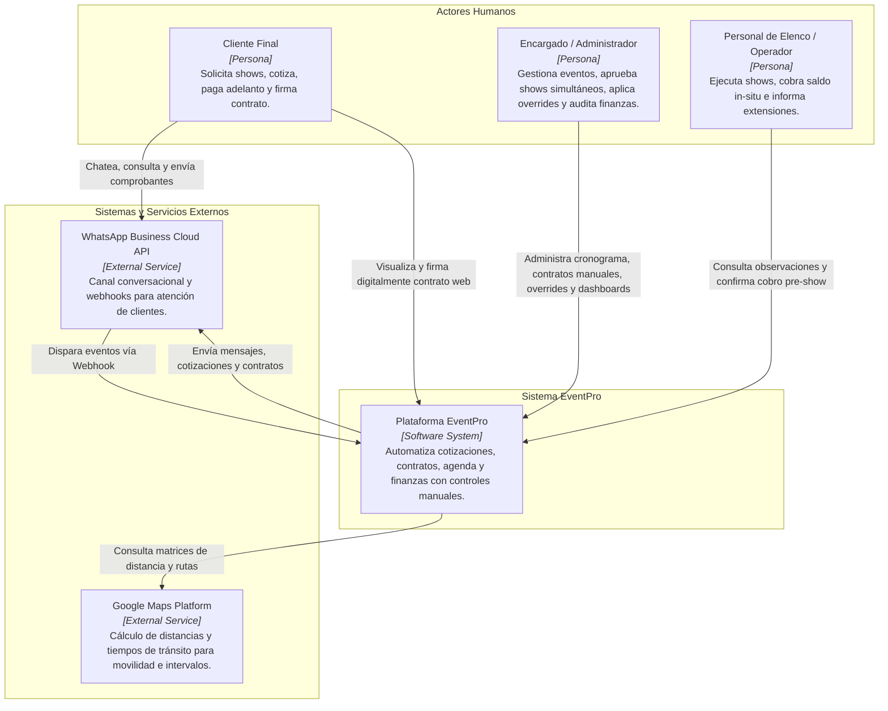
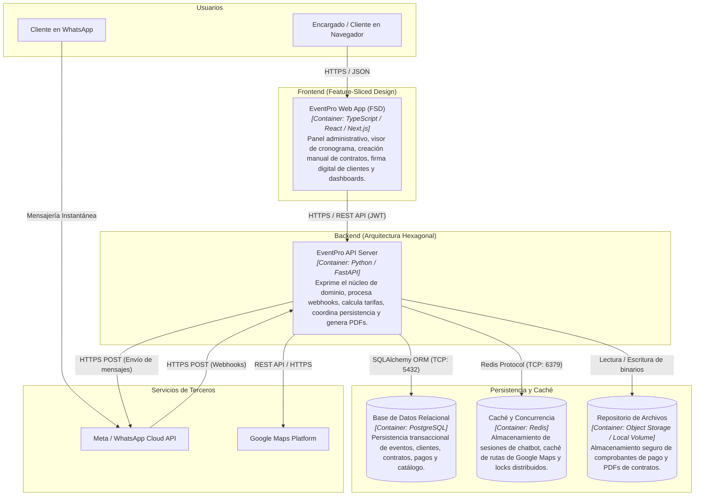
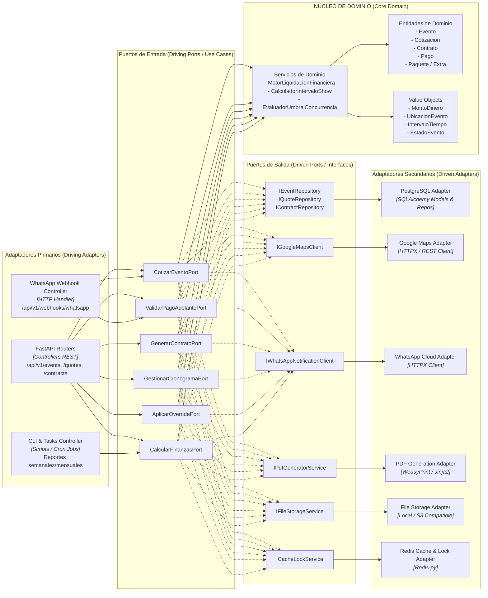

# 01. Diseño Arquitectónico Global y Modelo C4

---

## 1. Visión General del Sistema

El ecosistema **EventPro** está diseñado bajo una arquitectura desacoplada y orientada al dominio:
* **Backend:** Implementado en **Python con FastAPI** bajo el patrón de **Arquitectura Hexagonal (Ports & Adapters)**, garantizando que las reglas de negocio (cálculo de cotizaciones, validaciones de disponibilidad, liquidación y control) sean completamente independientes del framework web, de la base de datos y de las APIs externas.
* **Frontend:** Implementado bajo la metodología **Feature-Sliced Design (FSD)**, organizando el código por responsabilidades de negocio y capas jerárquicas estrictas para máxima escalabilidad y mantenibilidad.

---

## 2. Modelo C4: Nivel 1 — Diagrama de Contexto del Sistema

Describe cómo interactúan los diferentes actores y sistemas externos con la plataforma EventPro.

---

## 3. Modelo C4: Nivel 2 — Diagrama de Contenedores

Describe las aplicaciones de software, almacenes de datos y servicios que componen EventPro.

---

## 4. Modelo C4: Nivel 3 — Diagrama de Componentes del Backend (Hexagonal)

El siguiente diagrama detalla cómo se organizan los componentes internos del Backend siguiendo los preceptos de la Arquitectura Hexagonal (*Ports & Adapters*).

