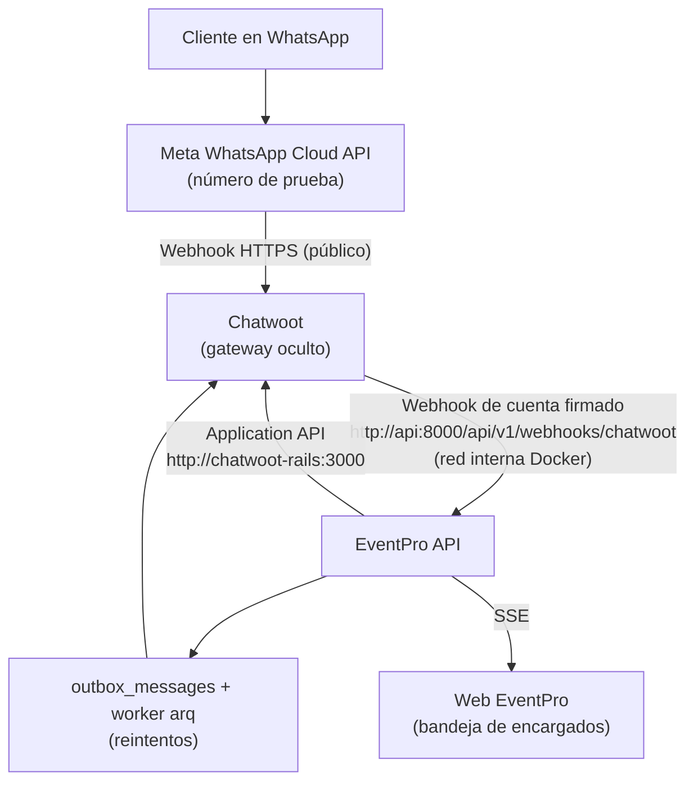

# 05. Especificación: Chatwoot como Gateway de Mensajería Oculto

* **Estado:** Propuesto (pendiente de revisión).
* **Fecha:** 2026-10-03.
* **Decisión asociada:** ADR-10 (por registrar en [`04-adr-decisiones-arquitectura.md`](04-adr-decisiones-arquitectura.md)); reemplaza la parte de WhatsApp de ADR-05. La parte de Google Maps de ADR-05 sigue vigente.

---

## 1. Contexto y objetivo

La documentación vigente integra el backend directamente con Meta WhatsApp Cloud API (`GET/POST /webhooks/whatsapp`). Esta especificación sustituye esa integración por **Chatwoot autoalojado** como gateway de mensajería, con dos objetivos:

1. **Traspaso del bot a un humano:** los encargados pueden tomar una conversación cuando el bot no basta o el cliente lo pide, y devolverla al bot.
2. **Bandeja de conversaciones dentro de EventPro:** los encargados leen y responden desde la plataforma web de EventPro.

**Chatwoot es invisible para los usuarios.** Ningún encargado ni cliente interactúa con la interfaz de Chatwoot; EventPro consume su API.

### 1.1 Restricciones

* Proyecto académico sin empresa real detrás: el canal usa el **número de prueba de Meta for Developers** (hasta 5 destinatarios verificados, sin verificación de negocio ni método de pago).
* El sistema debe permanecer operativo hasta el **2026-12-15** (presentación final).
* Presupuesto total de US$20, reservado principalmente para OpenAI: la infraestructura debe costar US$0.
* **Costos de Meta (vigentes desde 2026-10-01):** los mensajes de servicio se cobran tras 1 000 gratuitos por número y mes, y las plantillas de utilidad dentro de la ventana de 24 h se cobran. Los números de prueba no requieren método de pago. Por ello:
  * Se permanece en el número de prueba hasta la presentación.
  * Dentro de la ventana de 24 h se responde con texto libre; las plantillas se reservan para mensajes fuera de la ventana (por ejemplo, el OTP de firma).

### 1.2 Fuera de alcance

* Agente conversacional con OpenAI y *tool calling* (especificación propia, posterior).
* Canales adicionales a WhatsApp, salvo el widget web como contingencia de demo (sección 6.4).
* Respuesta desde la app móvil de Chatwoot.
* Un usuario de Chatwoot por cada encargado.
* Búfer de reenvío de eventos SSE perdidos.

---

## 2. Arquitectura

### 2.1 Puertos y adaptadores

* **Puerto de salida único `IMessagingPort`:** reemplaza a `IWhatsAppServicePort`. Envía texto, listas interactivas, plantillas y adjuntos; cambia el estado de una conversación; consulta conversaciones y mensajes.
* **Adaptador `ChatwootMessagingAdapter`** (cliente `httpx`): implementa `IMessagingPort` sobre la Application API de Chatwoot. Volver a Meta directo requeriría solo otro adaptador; el dominio no cambia.
* **Adaptador de entrada `chatwoot_webhook.py`:** reemplaza a `whatsapp_webhook.py`.

### 2.2 Capacidades de Chatwoot utilizadas

| Necesidad | Mecanismo en Chatwoot |
|---|---|
| Catálogo, extras, botón «Pagar adelanto» | `content_attributes.items` → lista interactiva de WhatsApp |
| OTP de firma fuera de la ventana de 24 h | `template_params` con botón `copy_code` (plantilla de autenticación) |
| Enlace de contrato, recordatorios | `template_params` (plantilla de utilidad) |
| Traspaso bot ↔ humano | `toggle_status`: `pending` (bot) / `open` (humano) |
| Comprobante de pago | Adjunto en el payload del webhook |

Las credenciales de Meta (token de *system user*, ID del número, ID de la cuenta de WhatsApp) se configuran **dentro de Chatwoot**, no en EventPro.

---

## 3. Conversaciones, bot y traspaso

### 3.1 Fuente de verdad

* **Chatwoot** es la fuente de verdad del canal: conversaciones, mensajes, medios, estados de entrega y `status`.
* **EventPro** solo almacena el vínculo de negocio en la tabla nueva `conversation_links`:

| Campo | Descripción |
|---|---|
| `chatwoot_conversation_id` | Identificador de la conversación en Chatwoot (único). |
| `client_id` | FK a `clients` (teléfono de WhatsApp como clave natural). |
| `quote_id` | FK opcional a la cotización vigente. |
| `assigned_user_id` | FK opcional al encargado que tomó la conversación. |
| `handoff_reason` | `CLIENT_REQUEST`, `BOT_NOT_UNDERSTOOD`, `MANUAL_TAKEOVER`, `BOT_ERROR` o nulo. |
| `handoff_summary` | Resumen generado al derivar (datos capturados, cotización vigente). |

No se duplican mensajes en la base de datos de EventPro.

### 3.2 Identidades en Chatwoot (invisibles)

* **Agent Bot** asignado a la bandeja de WhatsApp: hace que las conversaciones nuevas nazcan en `pending` y firma los mensajes del bot. Se debe verificar en la implementación que funcione sin `outgoing_url`.
* **Agente de servicio único:** su token envía los mensajes que escriben los encargados desde EventPro. El autor real queda registrado en `audit_logs` de EventPro.

### 3.3 Entrada de eventos

`POST /api/v1/webhooks/chatwoot` recibe el **webhook de cuenta** de Chatwoot:

1. Valida `X-Chatwoot-Signature` = `sha256=HMAC-SHA256(CHATWOOT_WEBHOOK_SECRET, "{X-Chatwoot-Timestamp}.{cuerpo_crudo}")` en tiempo constante, y rechaza timestamps con más de 5 minutos de antigüedad. Sin firma válida responde `401` y no encola nada.
2. Descarta duplicados por identificador de mensaje/evento (Redis, TTL de 7 días).
3. Responde `200` en menos de 1.5 s y encola el evento en arq.

El worker enruta:

* **Mensaje entrante (`message_created`, `incoming`) en conversación `pending`:** lo procesa el bot, con estado conversacional en Redis por `conversation_id`. Un comprobante adjunto ejecuta el caso de uso de RF-11.
* **Cualquier otro evento** (mensajes nuevos, cambios de estado, actualizaciones de entrega): se publica a la web de EventPro por SSE.

El endpoint **no se expone a internet**: el proxy lo bloquea y solo es accesible por la red interna de Docker.

### 3.4 API para la bandeja de EventPro

Roles `ENCARGADO` y `SUPERADMIN`:

| Método y ruta | Descripción |
|---|---|
| `GET /conversations` | Bandeja con filtros: bot, humano, asignadas al usuario. |
| `GET /conversations/{id}/messages` | Mensajes de la conversación (consultados a Chatwoot). |
| `GET /conversations/{id}/attachments/{attachment_id}` | Sirve un adjunto de la conversación a través de EventPro (proxy hacia Chatwoot); sus URL no se exponen al navegador. |
| `POST /conversations/{id}/messages` | Envía texto o adjuntos como el agente de servicio. |
| `POST /conversations/{id}/takeover` | Pasa a `open`, asigna al encargado; el bot deja de responder. |
| `POST /conversations/{id}/release` | Vuelve a `pending`; responde el bot. |
| `GET /conversations/stream` | Eventos en tiempo real (SSE). |

### 3.5 Traspaso

* **Disparadores:** el cliente lo solicita (opción «Hablar con un encargado» o texto equivalente), el bot no entiende dos veces consecutivas, o un encargado ejecuta `takeover`.
* **Al derivar:** el bot avisa al cliente («Te comunico con un encargado»), registra `handoff_reason` y `handoff_summary`, y la conversación pasa a `open` sin asignar, con aviso en tiempo real en la bandeja.
* **Retorno al bot:** el encargado ejecuta `release`. Si la conversación se resuelve y el cliente vuelve a escribir, se debe verificar en la implementación que se reabra en `pending`; si no, se documenta el retorno manual.
* **Decisiones de negocio** (aprobación del adelanto, sobrecupo, rechazo de comprobante) se mantienen en el panel de EventPro; no se toman desde la conversación.

### 3.6 Ventana de 24 horas

La bandeja indica si la ventana de servicio está abierta. Con la ventana cerrada solo permite enviar plantillas aprobadas.

---

## 4. Resiliencia

| Escenario | Comportamiento |
|---|---|
| Chatwoot caído (salida) | Todo envío pasa por `outbox_messages`. Reintentos con espera creciente: 30 s, 2 min, 10 min, 30 min, 2 h. Agotados, el mensaje queda `FAILED` y la bandeja ofrece «Reintentar». Ninguna operación de negocio se bloquea. |
| Chatwoot caído (entrada) | Meta reintenta sus webhooks hacia Chatwoot. Como no está confirmado que Chatwoot reintente los suyos, un **job de reconciliación** consulta cada 5 minutos las conversaciones actualizadas desde el último cursor y procesa los mensajes entrantes no vistos; la idempotencia hace seguro el reproceso. |
| Webhooks duplicados o fuera de orden | Deduplicación por identificador en Redis (TTL de 7 días). Procesamiento serial por conversación mediante lock de Redis por `conversation_id`. |
| Meta rechaza un mensaje | Ventana de 24 h cerrada o número fuera de los 5 destinatarios de prueba: Chatwoot emite `message_updated` con estado `failed`; la bandeja muestra un motivo legible. |
| Excepción no controlada del bot | El bot responde «Tuvimos un problema, te comunico con un encargado» y deriva con `handoff_reason = BOT_ERROR`. |
| Desconexión SSE | Reconexión automática; al reconectar, la web vuelve a solicitar la bandeja completa. |
| Vencimiento de tokens | El token temporal del número de prueba de Meta expira (aprox. 24 h, por confirmar); en Chatwoot se usa el token permanente de un *system user*. Los tokens de Chatwoot no expiran. |

---

## 5. Configuración

Variables nuevas de EventPro (sustituyen a `WHATSAPP_*`, que pasan a configurarse dentro de Chatwoot):

| Variable | Descripción |
|---|---|
| `CHATWOOT_BASE_URL` | URL interna de Chatwoot (`http://chatwoot-rails:3000`). |
| `CHATWOOT_ACCOUNT_ID` | Cuenta de Chatwoot. |
| `CHATWOOT_INBOX_ID` | Bandeja de WhatsApp. |
| `CHATWOOT_BOT_TOKEN` | Token del Agent Bot (mensajes del bot). |
| `CHATWOOT_AGENT_TOKEN` | Token del agente de servicio (mensajes de encargados). |
| `CHATWOOT_WEBHOOK_SECRET` | Secreto de la firma del webhook de cuenta. |

En `staging` y `production` los tokens y el secreto se inyectan desde el gestor de secretos de la plataforma.

---

## 6. Infraestructura

### 6.1 Exposición pública

* **Públicos (vía proxy con HTTPS):** web de EventPro (encargados), API de EventPro (web y enlace de firma del cliente) y Chatwoot (solo para el webhook de Meta).
* **Interno:** `/api/v1/webhooks/chatwoot`, bloqueado en el proxy.

### 6.2 Servidor

* **Oracle Cloud Always Free**, VM ARM de 2 OCPU y 12 GB, con la cuenta en **Pay As You Go** (prioridad de capacidad, sin cargos dentro de los límites gratuitos) y alerta de presupuesto.
* **Respaldos de hosting:** créditos de cuenta nueva de AWS (US$200) o Azure for Students (US$100).
* **Proxy Caddy** con HTTPS automático (Let's Encrypt).
* **Dominio gratuito DuckDNS** con subdominios `app.`, `api.` y `chat.` (por confirmar la resolución de subdominios; alternativa: enrutamiento por ruta en un solo dominio).
* **Firewall:** abrir 80/443 en la *Security List* de la VCN **y** en `iptables` de la VM.
* **Memoria estimada:** Chatwoot ~4 GB, EventPro ~1.5 GB, Caddy marginal; se agregan 2 GB de swap.
* **Respaldo de datos:** `pg_dump` diario de ambas bases, conservando los últimos 7.
* **Imágenes ARM64:** la imagen oficial de Chatwoot publica `linux/arm64`; se confirma con `docker manifest inspect` antes del despliegue.

### 6.3 Archivos Compose

| Archivo | Servicios | Uso |
|---|---|---|
| `docker-compose.yml` | `api`, `worker`, `db`, `redis` | Siempre (sin cambios estructurales). |
| `docker-compose.chatwoot.yml` | `chatwoot-rails`, `chatwoot-sidekiq`, `chatwoot-db` (pgvector, PostgreSQL 16), `chatwoot-redis` | Se une a `eventpro_network`. Opcional en desarrollo. |
| `docker-compose.proxy.yml` | `caddy` | Solo en el servidor. |

Chatwoot usa su propia base de datos y su propio Redis; no comparte `db` ni `redis` de EventPro.

### 6.4 Desarrollo local y contingencia de demo

* **Desarrollo:** dominio estático gratuito de **ngrok** para que Meta alcance al Chatwoot local con una URL fija (alternativa: Cloudflare Tunnel).
* **Contingencia 1 (falla Meta):** bandeja *Website widget* en Chatwoot con el mismo Agent Bot, embebida en una página de demo. El bot solicita el teléfono al cliente, porque `clients` usa el número como clave natural.
* **Contingencia 2 (cae el servidor):** video grabado del flujo completo.

---

## 7. Pruebas

| Nivel | Alcance | Herramienta |
|---|---|---|
| Unitarias de dominio y casos de uso | Traspaso (tres disparadores), enrutamiento de eventos, reglas de la ventana de 24 h | `FakeMessagingPort` en memoria |
| Unitarias del adaptador | Texto, listas, plantillas, adjuntos, `toggle_status`, errores 4xx/5xx | `httpx.MockTransport` |
| Firma del webhook | Válida, inválida, timestamp vencido, cuerpo alterado | Pruebas puras sobre bytes |
| Integración | Webhook (idempotencia, lock, encolado), `/conversations` con RBAC, `conversation_links` | FastAPI `TestClient` + Testcontainers (PostgreSQL, Redis) |
| Fixtures | Payloads reales capturados del Chatwoot local | `tests/fixtures/chatwoot/*.json` |
| End-to-end manual | Cotizar, enviar comprobante, solicitar encargado, responder desde EventPro, devolver al bot, número no registrado | Checklist con el número de prueba |

No se levanta Chatwoot completo en CI (cuatro contenedores, ~4 GB); las fixtures reales cubren el contrato. No se agregan dependencias de prueba.

---

## 8. Impacto en la documentación

| Documento | Cambio |
|---|---|
| `02-arquitectura/04-adr-decisiones-arquitectura.md` | ADR-10 «Chatwoot como gateway de mensajería oculto»; ADR-05 queda limitado a Google Maps y referencia a ADR-10. |
| `02-arquitectura/01-diseno-arquitectonico-c4.md` | Chatwoot entre Meta y la API; `IMessagingPort`. |
| `02-arquitectura/02-backend-arquitectura-hexagonal.md` | `IMessagingPort`, `ChatwootMessagingAdapter`, `chatwoot_webhook.py`. |
| `02-arquitectura/03-frontend-arquitectura-fsd.md` | *Feature* de bandeja y conversación con SSE. |
| `04-api/01-especificacion-endpoints-rest.md` | Sale `/webhooks/whatsapp`; entran `/webhooks/chatwoot` y `/conversations/*`. |
| `04-api/02-matriz-rbac-y-seguridad.md` | Permisos de `/conversations/*`; firma del webhook de Chatwoot. |
| `03-datos/01-diagrama-entidad-relacion.md`, `02-diccionario-de-datos.md`, `03-estrategia-migraciones-y-seeds.md` | Tabla `conversation_links`. |
| `01-requisitos/02-requerimientos-funcionales.md`, `05-historias-de-usuario.md` | M01 vía gateway; requisitos e historias de traspaso y bandeja. |
| `01-requisitos/03-requerimientos-no-funcionales.md` | Recepción del webhook por Chatwoot; reconciliación. |
| `05-operaciones/01-guia-entorno-y-configuracion.md` | `WHATSAPP_*` → `CHATWOOT_*`. |
| `05-operaciones/02-docker-e-infraestructura-local.md` | Tres archivos Compose, ngrok, Caddy. |
| `05-operaciones/04-division-de-epicas-del-equipo.md` | Ubicación del trabajo en las épicas. |
| `Docs/README.md` | Índice con esta especificación. |

---

## 9. Verificaciones pendientes durante la implementación

1. El Agent Bot funciona asignado a la bandeja sin `outgoing_url`.
2. Una conversación resuelta se reabre en `pending` cuando el cliente vuelve a escribir.
3. Chatwoot acepta conectar el canal oficial con las credenciales del número de prueba.
4. La cuenta de prueba de Meta permite crear plantillas propias (OTP de autenticación).
5. Duración del token temporal de Meta y configuración del token de *system user*.
6. DuckDNS resuelve subdominios de segundo nivel.
7. Disponibilidad `linux/arm64` de las imágenes usadas.
