# 01. Diagrama Entidad-Relación (DER)

---

## 1. Visión General del Modelo de Persistencia

El modelo de datos de **EventPro** está diseñado para garantizar la integridad transaccional (cumplimiento ACID) de la promotora de eventos. Utiliza **PostgreSQL** como motor relacional, claves primarias basadas en **UUIDv4** para evitar enumeración y desacoplar la generación de identificadores, y tipos de datos numéricos exactos (`NUMERIC(10,2)`) para evitar cualquier distorsión por coma flotante en cotizaciones y balances.

---

## 2. Diagrama Entidad-Relación (Mermaid)

```mermaid
erDiagram
    USERS ||--o{ REFRESH_TOKENS : has
    ROLES ||--o{ USERS : assigns

    CLIENTS ||--o{ QUOTES : requests

    PACKAGES ||--o{ PACKAGE_THEMES : contains
    THEMES ||--o{ PACKAGE_THEMES : defines
    PACKAGES ||--o{ PACKAGE_INVENTORY_ITEMS : consumes
    INVENTORY_ITEMS ||--o{ PACKAGE_INVENTORY_ITEMS : consumed_by

    QUOTES ||--o{ QUOTE_EXTRAS : includes
    EXTRAS ||--o{ QUOTE_EXTRAS : references
    PACKAGES ||--o{ QUOTES : selects
    THEMES |o--o{ QUOTES : configures

    QUOTES ||--o| EVENTS : generates
    QUOTES ||--o{ PAYMENTS : paid_by
    EVENTS |o--o{ PAYMENTS : receives
    EVENTS ||--o{ CONTRACTS : formalizes
    EVENTS ||--o{ EVENT_EXTENSIONS : logs
    PAYMENTS ||--o| EVENT_EXTENSIONS : charges
    EVENTS ||--o{ CREW_ASSIGNMENTS : assigns
    EVENTS ||--o{ INVENTORY_RESERVATIONS : reserves
    INVENTORY_ITEMS ||--o{ INVENTORY_RESERVATIONS : reserved_in

    USERS |o--o| CREWS : operates
    CREWS ||--o{ CREW_ASSIGNMENTS : participates
    USERS |o--o{ PAYMENTS : verifies_registers_audits
    USERS |o--o{ AUDIT_LOGS : performs

    ROLES {
        uuid id PK "default gen_random_uuid()"
        varchar(30) code UK "UNIQUE"
        varchar(60) name
        text description "NULL"
    }

    USERS {
        uuid id PK "default gen_random_uuid()"
        uuid role_id FK "FK (roles.id)"
        varchar(120) full_name
        varchar(150) email UK "UNIQUE"
        varchar(20) phone UK "UNIQUE"
        varchar(255) hashed_password
        boolean is_active "default TRUE"
        timestamptz created_at "default CURRENT_TIMESTAMP"
    }

    REFRESH_TOKENS {
        uuid id PK "default gen_random_uuid()"
        uuid user_id FK "FK (users.id ON DELETE CASCADE), INDEX"
        varchar(64) token_hash UK "UNIQUE"
        timestamptz expires_at "INDEX"
        boolean is_revoked "default FALSE"
        timestamptz created_at "default CURRENT_TIMESTAMP"
    }

    CLIENTS {
        uuid id PK "default gen_random_uuid()"
        varchar(20) phone UK "UNIQUE"
        varchar(120) full_name
        varchar(8) dni "NULL; CHECK (dni ~ '^[0-9]+$' AND length(dni) = 8)"
        varchar(11) ruc "NULL; CHECK (ruc ~ '^[0-9]+$' AND length(ruc) = 11)"
        timestamptz created_at "default CURRENT_TIMESTAMP"
    }

    PACKAGES {
        uuid id PK "default gen_random_uuid()"
        varchar(100) name
        varchar(30) service_category "CHECK in (SHOW, DJ, DECORATION, TENTS)"
        text description "NULL"
        numeric(10_2) base_price "CHECK (base_price > 0)"
        numeric(10_2) direct_cost "CHECK (direct_cost >= 0)"
        integer duration_minutes "default 60; CHECK (duration_minutes > 0)"
        boolean is_active "default TRUE"
    }

    THEMES {
        uuid id PK "default gen_random_uuid()"
        varchar(80) name UK "UNIQUE"
        text description "NULL"
        boolean is_active "default TRUE"
    }

    PACKAGE_THEMES {
        uuid id PK "default gen_random_uuid()"
        uuid package_id FK "FK (packages.id)"
        uuid theme_id FK "FK (themes.id)"
    }

    PACKAGE_INVENTORY_ITEMS {
        uuid id PK "default gen_random_uuid()"
        uuid package_id FK "FK (packages.id ON DELETE CASCADE)"
        uuid inventory_item_id FK "FK (inventory_items.id), INDEX"
        integer quantity "default 1; CHECK (quantity > 0)"
        timestamptz created_at "default CURRENT_TIMESTAMP"
    }

    EXTRAS {
        uuid id PK "default gen_random_uuid()"
        varchar(100) name
        text description "NULL"
        numeric(10_2) sale_price "CHECK (sale_price >= 0)"
        numeric(10_2) direct_cost "CHECK (direct_cost >= 0)"
        boolean is_active "default TRUE"
    }

    INVENTORY_ITEMS {
        uuid id PK "default gen_random_uuid()"
        varchar(100) name UK "UNIQUE"
        varchar(30) service_category "CHECK in (DECORATION, TENTS)"
        integer total_stock "CHECK (total_stock >= 0)"
        text description "NULL"
        boolean is_active "default TRUE"
    }

    INVENTORY_RESERVATIONS {
        uuid id PK "default gen_random_uuid()"
        uuid event_id FK "FK (events.id), INDEX"
        uuid inventory_item_id FK "FK (inventory_items.id)"
        integer quantity "default 1; CHECK (quantity > 0)"
        timestamptz starts_at
        timestamptz ends_at "CHECK (ends_at > starts_at)"
        varchar(20) status "default 'ACTIVE'; CHECK in (ACTIVE, RELEASED)"
        timestamptz created_at "default CURRENT_TIMESTAMP"
    }

    QUOTES {
        uuid id PK "default gen_random_uuid()"
        uuid client_id FK "FK (clients.id), INDEX"
        varchar(20) source "default 'WHATSAPP'; CHECK in (WHATSAPP, MANUAL)"
        date event_date "INDEX"
        time event_time
        varchar(255) location_address
        varchar(80) location_district "INDEX"
        numeric(10_7) latitude "NULL"
        numeric(10_7) longitude "NULL"
        uuid package_id FK "FK (packages.id)"
        uuid theme_id FK "NULL; FK (themes.id)"
        boolean client_provides_mobility "default FALSE"
        numeric(6_2) calculated_distance_km "NULL; default 0.00"
        integer calculated_transit_minutes "NULL; default 0"
        numeric(10_2) base_mobility_amount "default 0.00"
        numeric(10_2) final_mobility_amount "default 0.00"
        boolean mobility_overridden "default FALSE"
        text mobility_override_reason "NULL"
        numeric(10_2) services_subtotal
        numeric(10_2) total_amount
        numeric(10_2) advance_amount
        numeric(10_2) pending_balance
        varchar(30) status "default 'SENT'; CHECK in (SENT, PAYMENT_STARTED, CONVERTED, EXPIRED, CANCELLED)"
        timestamptz sent_at
        timestamptz expires_at "INDEX"
        timestamptz created_at "default CURRENT_TIMESTAMP"
    }

    QUOTE_EXTRAS {
        uuid id PK "default gen_random_uuid()"
        uuid quote_id FK "FK (quotes.id ON DELETE CASCADE)"
        uuid extra_id FK "FK (extras.id)"
        integer quantity "default 1; CHECK (quantity > 0)"
        numeric(10_2) unit_price
        numeric(10_2) subtotal
    }

    EVENTS {
        uuid id PK "default gen_random_uuid()"
        varchar(30) event_code UK "UNIQUE"
        uuid quote_id FK, UK "FK (quotes.id), UNIQUE"
        date event_date "INDEX"
        time start_time
        time end_time
        varchar(255) address
        varchar(80) district "INDEX"
        text client_observations "NULL"
        varchar(30) status "default 'AWAITING_SIGNATURE'; CHECK in (AWAITING_SIGNATURE, SCHEDULED, AWAITING_BALANCE, IN_PROGRESS, EXTENDED, SETTLED, CANCELLED)"
        numeric(10_2) total_services_amount
        numeric(10_2) total_mobility_amount
        numeric(10_2) final_total_amount
        numeric(10_2) advance_paid "default 0.00"
        numeric(10_2) pre_show_balance_paid "default 0.00"
        numeric(10_2) extra_hours_amount "default 0.00"
        timestamptz created_at "default CURRENT_TIMESTAMP"
    }

    CONTRACTS {
        uuid id PK "default gen_random_uuid()"
        varchar(30) contract_number UK "UNIQUE"
        uuid event_id FK "FK (events.id), INDEX"
        varchar(255) pdf_storage_path "NULL; CHECK (status = 'DRAFT' OR pdf_storage_path IS NOT NULL)"
        varchar(64) signature_token_hash UK "NULL; UNIQUE"
        timestamptz signature_token_expires_at "NULL"
        varchar(255) otp_hash "NULL"
        timestamptz otp_expires_at "NULL"
        integer otp_attempts "default 0; CHECK (otp_attempts >= 0)"
        varchar(255) signature_image_path "NULL"
        varchar(45) signer_ip "NULL"
        varchar(255) signer_user_agent "NULL"
        timestamptz signed_at "NULL"
        varchar(255) sealed_pdf_storage_path "NULL"
        char(64) sealed_pdf_sha256 "NULL"
        boolean is_timestamped "default FALSE"
        varchar(30) status "default 'DRAFT'; CHECK in (DRAFT, ISSUED, SIGNED, VOIDED)"
        boolean is_manual_mode "default FALSE"
        text custom_clauses "NULL"
        timestamptz created_at "default CURRENT_TIMESTAMP"
    }

    PAYMENTS {
        uuid id PK "default gen_random_uuid()"
        uuid quote_id FK "FK (quotes.id), INDEX"
        uuid event_id FK "NULL; FK (events.id), INDEX"
        varchar(20) concept "CHECK in (ADVANCE, BALANCE, EXTENSION)"
        varchar(30) payment_method "CHECK in (YAPE, PLIN, BANK_TRANSFER, CASH)"
        numeric(10_2) amount "CHECK (amount > 0)"
        varchar(255) evidence_path
        varchar(60) transaction_reference "NULL"
        varchar(30) validation_status "default 'PENDING_VERIFICATION'; CHECK in (PENDING_VERIFICATION, REQUIRES_MANUAL_APPROVAL, VERIFIED, REJECTED, REFUND_PENDING, REFUNDED)"
        text rejection_reason "NULL"
        uuid verified_by_user_id FK "NULL; FK (users.id)"
        timestamptz verified_at "NULL"
        uuid registered_by_user_id FK "NULL; FK (users.id)"
        varchar(20) audit_status "NULL; CHECK in (UNREVIEWED, REVIEWED, FLAGGED)"
        uuid audited_by_user_id FK "NULL; FK (users.id)"
        timestamptz audited_at "NULL"
        text audit_notes "NULL"
        timestamptz created_at "default CURRENT_TIMESTAMP"
    }

    CREWS {
        uuid id PK "default gen_random_uuid()"
        uuid user_id FK, UK "NULL; FK (users.id), UNIQUE"
        varchar(120) leader_name
        varchar(20) phone
        varchar(30) service_category "CHECK in (SHOW, DJ, DECORATION, TENTS)"
        boolean is_active "default TRUE"
    }

    CREW_ASSIGNMENTS {
        uuid id PK "default gen_random_uuid()"
        uuid event_id FK "FK (events.id), INDEX"
        uuid crew_id FK "FK (crews.id), INDEX"
        integer transit_interval_minutes "NULL; CHECK (transit_interval_minutes >= 0)"
        boolean transit_interval_overridden "default FALSE"
        timestamptz assigned_at "default CURRENT_TIMESTAMP"
    }

    EVENT_EXTENSIONS {
        uuid id PK "default gen_random_uuid()"
        uuid event_id FK "FK (events.id), INDEX"
        uuid payment_id FK, UK "FK (payments.id), UNIQUE"
        integer extra_minutes "CHECK (extra_minutes > 0)"
        numeric(10_2) agreed_rate "CHECK (agreed_rate > 0)"
        timestamptz requested_at "default CURRENT_TIMESTAMP"
    }

    OUTBOX_MESSAGES {
        uuid id PK "default gen_random_uuid()"
        varchar(20) recipient_phone
        varchar(30) message_type "CHECK in (TEXT, TEMPLATE, INTERACTIVE, DOCUMENT)"
        jsonb payload "NULL"
        varchar(20) status "default 'PENDING'; CHECK in (PENDING, SENT, FAILED)"
        integer attempts "default 0; CHECK (attempts >= 0)"
        integer max_attempts "default 5; CHECK (max_attempts > 0)"
        timestamptz next_attempt_at "default CURRENT_TIMESTAMP; INDEX"
        text last_error "NULL"
        timestamptz sent_at "NULL"
        timestamptz created_at "default CURRENT_TIMESTAMP"
    }

    AUDIT_LOGS {
        uuid id PK "default gen_random_uuid()"
        uuid user_id FK "NULL; FK (users.id)"
        varchar(50) action "CHECK in (OVERRIDE_MOBILITY, OVERRIDE_TRANSIT_INTERVAL, APPROVE_OVERBOOKED_PAYMENT, REJECT_OVERBOOKED_PAYMENT, AUDIT_PAYMENT, MANUAL_CONTRACT, CONTRACT_SIGNED)"
        varchar(50) entity_name
        uuid entity_id "INDEX (entity_name, entity_id)"
        jsonb old_values "NULL"
        jsonb new_values "NULL"
        timestamptz created_at "default CURRENT_TIMESTAMP"
    }
```

---

## 3. Restricciones a Nivel de Tabla

Restricciones compuestas, parciales o de varias columnas que no se pueden expresar en la sintaxis de atributos del diagrama. Son las mismas que figuran en el [Diccionario de Datos](02-diccionario-de-datos.md).

* **`package_inventory_items`**
  * `UNIQUE(package_id, inventory_item_id)`
  * `INDEX(inventory_item_id)`
  * Un paquete puede consumir varios ítems de inventario (por ejemplo, un toldo y un kit de decoración). Un paquete sin filas en esta tabla (`SHOW`, `DJ`) no consume inventario.
* **`package_themes`**
  * `UNIQUE(package_id, theme_id)`
* **`inventory_reservations`**
  * Se crea una fila por cada fila de `package_inventory_items` del paquete cuando se crea el evento, copiando `quantity`; la reserva es por evento e ítem.
  * `INDEX(inventory_item_id, starts_at, ends_at)` para calcular el stock disponible en una ventana. La verificación se ejecuta bajo el lock distribuido de ADR-06: `total_stock` menos la suma de `quantity` de reservas `ACTIVE` solapadas debe cubrir la cantidad solicitada.
* **`quotes`**
  * Una cotización `MANUAL` (RF-23) sigue el mismo ciclo de vida; el evento y el contrato se crean cuando el adelanto es registrado y validado.
* **`contracts`**
  * `CREATE UNIQUE INDEX uq_contracts_event_active ON contracts (event_id) WHERE status <> 'VOIDED'`: un solo contrato vigente por evento; tras anular, se puede emitir uno nuevo.
  * `CHECK (status <> 'SIGNED' OR (signed_at IS NOT NULL AND sealed_pdf_storage_path IS NOT NULL AND sealed_pdf_sha256 IS NOT NULL))`
* **`payments`**
  * `CHECK ((concept = 'ADVANCE') = (audit_status IS NULL))`: solo los cobros in situ se auditan.
  * `CHECK (concept = 'ADVANCE' OR (validation_status = 'VERIFIED' AND registered_by_user_id IS NOT NULL AND event_id IS NOT NULL))`: `BALANCE` y `EXTENSION` se registran como verificados, por un usuario identificado y sobre un evento existente.
  * `CHECK (audit_status IS DISTINCT FROM 'FLAGGED' OR audit_notes IS NOT NULL)`
* **`crew_assignments`**
  * `UNIQUE(event_id, crew_id)`
* **`outbox_messages`**
  * `INDEX(status, next_attempt_at)` para el despachador de mensajes pendientes.

---

## 4. Convenciones del Diagrama

* Los tipos se escriben como en el diccionario; las precisiones `NUMERIC(p,s)` se representan `numeric(p_s)` por limitación de la sintaxis de Mermaid.
* El comentario de cada atributo indica `NULL` (si admite nulos), el valor por defecto y las restricciones. Los atributos sin la marca `NULL` son `NOT NULL`.
* `payments.quote_id` es obligatorio y `payments.event_id` es opcional: el adelanto se registra antes de que exista el evento.
* Un evento puede tener varios contratos a lo largo del tiempo, pero solo uno no anulado (`VOIDED`) simultáneamente (índice único parcial).
