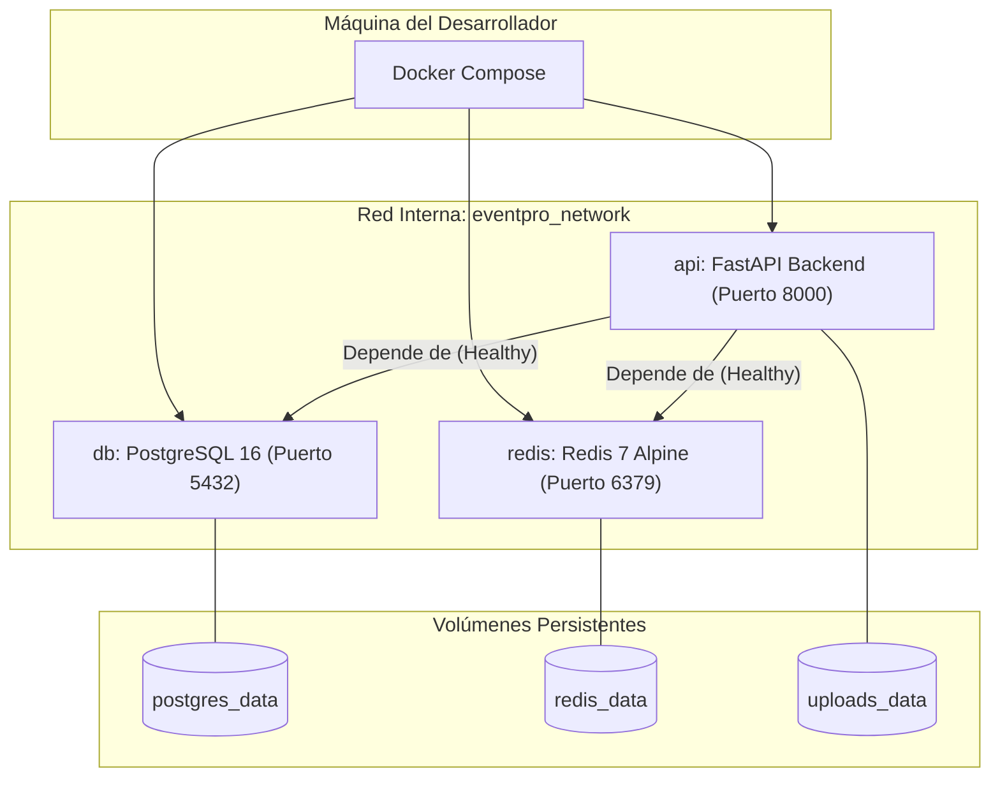

# 02. Docker e Infraestructura de Desarrollo Local

---

## 1. Arquitectura de Contenedores Local

Para garantizar la reproducibilidad absoluta del entorno de desarrollo sin conflictos de dependencias en Windows, Linux o macOS, la infraestructura local de EventPro se orquesta mediante **Docker Compose**.



---

## 2. Comandos Operativos Clave

### 2.1 Levantar Infraestructura Completa
```bash
docker compose up -d --build
```

### 2.2 Verificación de Estado y Logs
```bash
docker compose ps
docker compose logs -f api
```

### 2.3 Ejecutar Migraciones de Base de Datos
```bash
docker compose exec api alembic upgrade head
```

### 2.4 Cargar Datos Semilla (Seeds de Catálogo y Roles)
```bash
docker compose exec api python -m app.infrastructure.persistence.seed
```

### 2.5 Ejecutar la Suite de Pruebas Automatizadas
```bash
docker compose exec api pytest -v --cov=app
```
