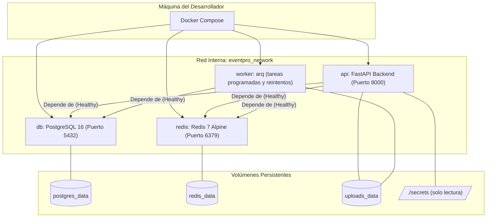

# 02. Docker e Infraestructura de Desarrollo Local

---

## 1. Arquitectura de Contenedores Local

Para garantizar la reproducibilidad absoluta del entorno de desarrollo sin conflictos de dependencias en Windows, Linux o macOS, la infraestructura local de EventPro se orquesta mediante **Docker Compose**.


```mermaid
flowchart TD
    subgraph Host["Máquina del Desarrollador"]
        Compose["Docker Compose"]
    end

    subgraph RedDocker["Red Interna: eventpro_network"]
        AppCont["api: FastAPI Backend (Puerto 8000)"]
        DbCont["db: PostgreSQL 16 (Puerto 5432)"]
        WorkerCont["worker: arq (tareas programadas y reintentos)"]
        RedisCont["redis: Redis 7 Alpine (Puerto 6379)"]
    end

    subgraph Volumenes["Volúmenes Persistentes"]
        VolPg[("postgres_data")]
        VolRedis[("redis_data")]
        VolUploads[("uploads_data")]
        BindSecrets[/"./secrets (solo lectura)"/]
    end

    Compose --> AppCont & WorkerCont & DbCont & RedisCont
    AppCont -->|"Depende de (Healthy)"| DbCont
    AppCont -->|"Depende de (Healthy)"| RedisCont
    WorkerCont -->|"Depende de (Healthy)"| DbCont
    WorkerCont -->|"Depende de (Healthy)"| RedisCont
    
    DbCont --- VolPg
    RedisCont --- VolRedis
    AppCont --- VolUploads
    WorkerCont --- VolUploads
    AppCont --- BindSecrets
```

---

## 2. Servicios, Volúmenes y Salud

| Servicio | Imagen | Función | Verificación de salud |
| :--- | :--- | :--- | :--- |
| `api` | `Dockerfile` (etapa `runner`) | FastAPI con `uvicorn app.main:app` (sin `--reload`) | `HEALTHCHECK` de la imagen: `GET /health` con la biblioteca estándar de Python |
| `worker` | La misma imagen | `arq app.infrastructure.adapters.primary.jobs.worker.WorkerSettings` (ADR-08) | Ninguna propia; depende de `db` y `redis` sanos |
| `db` | `postgres:16-alpine` | PostgreSQL | `pg_isready` |
| `redis` | `redis:7-alpine` | Caché, locks y cola de tareas | `redis-cli ping` |

* **Orden de arranque:** `api` y `worker` esperan a que `db` y `redis` estén `service_healthy`.
* **Volúmenes:** `postgres_data`, `redis_data` y `uploads_data` (comprobantes y contratos en `/app/uploads`, compartido por `api` y `worker`).
* **Certificado de firma:** `./secrets` se monta en `/run/secrets` en solo lectura; la variable `SIGNATURE_PKCS12_PATH` apunta a `/run/secrets/eventpro-signing.p12`.
* **Imagen:** multi-etapa, instala solo `requirements.txt` y ejecuta como usuario sin privilegios `eventpro` (UID 10001), propietario de `/app/uploads`.
* **Puertos:** PostgreSQL y Redis se publican solo en `127.0.0.1`.

### 2.1 Modo desarrollo y modo producción

`docker-compose.override.yml` se aplica automáticamente con `docker compose up` y activa la recarga en caliente (`uvicorn --reload`, `arq --watch`) con el código `./app` montado desde el host. Para ejecutar con la configuración base, sin override (producción o staging):

```bash
docker compose -f docker-compose.yml up -d --build
```

---

## 3. Comandos Operativos Clave

### 3.1 Levantar Infraestructura Completa
```bash
docker compose up -d --build
```

### 3.2 Verificación de Estado y Logs
```bash
docker compose ps
docker compose logs -f api worker
curl -s http://localhost:8000/health
```

### 3.3 Ejecutar Migraciones de Base de Datos
```bash
docker compose exec api alembic upgrade head
```

### 3.4 Cargar Datos Semilla (Seeds de Catálogo y Roles)
```bash
docker compose exec api python -m app.infrastructure.adapters.secondary.persistence.seed
```

### 3.5 Crear el Primer Usuario `SUPERADMIN`
```bash
docker compose exec -e SUPERADMIN_EMAIL=admin@eventpro.pe -e SUPERADMIN_PASSWORD='<contraseña-segura>' api \
  python -m app.infrastructure.adapters.secondary.persistence.bootstrap_superadmin
```
Detalle en [Estrategia de Migraciones y Seeds, sección 4](../03-datos/03-estrategia-migraciones-y-seeds.md#4-comando-de-arranque-del-usuario-superadmin).

### 3.6 Ejecutar la Suite de Pruebas Automatizadas
```bash
python3.12 -m venv .venv && source .venv/bin/activate
pip install -r requirements-dev.txt
pytest -v --cov=app
```
Las herramientas de prueba y calidad no forman parte de la imagen de runtime (solo `requirements.txt`), por lo que la suite se ejecuta en un entorno virtual local. Las pruebas de integración usan PostgreSQL temporal mediante Testcontainers y requieren Docker en ejecución.
