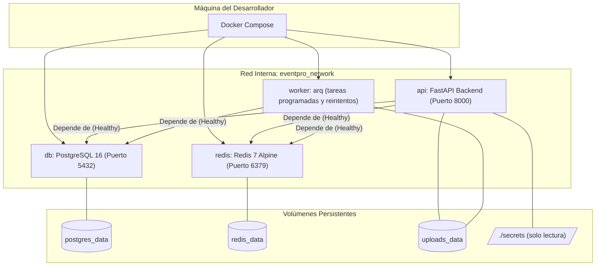

# 02. Docker e Infraestructura de Desarrollo Local

---

## 1. Arquitectura de Contenedores Local

Para garantizar la reproducibilidad absoluta del entorno de desarrollo sin conflictos de dependencias en Windows, Linux o macOS, la infraestructura local de EventPro se orquesta mediante **Docker Compose**.


```mermaid
flowchart TD
    subgraph Host["Máquina del Desarrollador"]
        Compose["Docker Compose"]
    end

    subgraph RedDocker["Red Interna: eventpro_network"]
        AppCont["api: FastAPI Backend (Puerto 8000)"]
        DbCont["db: PostgreSQL 16 (Puerto 5432)"]
        WorkerCont["worker: arq (tareas programadas y reintentos)"]
        RedisCont["redis: Redis 7 Alpine (Puerto 6379)"]
    end

    subgraph Volumenes["Volúmenes Persistentes"]
        VolPg[("postgres_data")]
        VolRedis[("redis_data")]
        VolUploads[("uploads_data")]
        BindSecrets[/"./secrets (solo lectura)"/]
    end

    Compose --> AppCont & WorkerCont & DbCont & RedisCont
    AppCont -->|"Depende de (Healthy)"| DbCont
    AppCont -->|"Depende de (Healthy)"| RedisCont
    WorkerCont -->|"Depende de (Healthy)"| DbCont
    WorkerCont -->|"Depende de (Healthy)"| RedisCont
    
    DbCont --- VolPg
    RedisCont --- VolRedis
    AppCont --- VolUploads
    WorkerCont --- VolUploads
    AppCont --- BindSecrets
```

> [!NOTE]
> El diagrama muestra el núcleo de EventPro. Chatwoot (gateway de WhatsApp) y el proxy HTTPS del servidor se agregan con archivos Compose opcionales; ver la sección 4.

---

## 2. Servicios, Volúmenes y Salud

| Servicio | Imagen | Función | Verificación de salud |
| :--- | :--- | :--- | :--- |
| `api` | `Dockerfile` (etapa `runner`) | FastAPI con `uvicorn app.main:app` (sin `--reload`) | `HEALTHCHECK` de la imagen: `GET /health` con la biblioteca estándar de Python |
| `worker` | La misma imagen | `arq app.infrastructure.adapters.primary.jobs.worker.WorkerSettings` (ADR-08) | Ninguna propia; depende de `db` y `redis` sanos |
| `db` | `postgres:16-alpine` | PostgreSQL | `pg_isready` |
| `redis` | `redis:7-alpine` | Caché, locks y cola de tareas | `redis-cli ping` |

* **Orden de arranque:** `api` y `worker` esperan a que `db` y `redis` estén `service_healthy`.
* **Volúmenes:** `postgres_data`, `redis_data` y `uploads_data` (comprobantes y contratos en `/app/uploads`, compartido por `api` y `worker`).
* **Certificado de firma:** `./secrets` se monta en `/run/secrets` en solo lectura; la variable `SIGNATURE_PKCS12_PATH` apunta a `/run/secrets/eventpro-signing.p12`.
* **Imagen:** multi-etapa, instala solo `requirements.txt` y ejecuta como usuario sin privilegios `eventpro` (UID 10001), propietario de `/app/uploads`.
* **Puertos:** PostgreSQL y Redis se publican solo en `127.0.0.1`.

### 2.1 Modo desarrollo y modo producción

`docker-compose.override.yml` se aplica automáticamente con `docker compose up` y activa la recarga en caliente (`uvicorn --reload`, `arq --watch`) con el código `./app` montado desde el host. Para ejecutar con la configuración base, sin override (producción o staging):

```bash
docker compose -f docker-compose.yml up -d --build
```

---

## 3. Comandos Operativos Clave

### 3.1 Levantar Infraestructura Completa
```bash
docker compose up -d --build
```

### 3.2 Verificación de Estado y Logs
```bash
docker compose ps
docker compose logs -f api worker
curl -s http://localhost:8000/health
```

### 3.3 Ejecutar Migraciones de Base de Datos
```bash
docker compose exec api alembic upgrade head
```

### 3.4 Cargar Datos Semilla (Seeds de Catálogo y Roles)
```bash
docker compose exec api python -m app.infrastructure.adapters.secondary.persistence.seed
```

### 3.5 Crear el Primer Usuario `SUPERADMIN`
```bash
docker compose exec -e SUPERADMIN_EMAIL=admin@eventpro.pe -e SUPERADMIN_PASSWORD='<contraseña-segura>' api \
  python -m app.infrastructure.adapters.secondary.persistence.bootstrap_superadmin
```
Detalle en [Estrategia de Migraciones y Seeds, sección 4](../03-datos/03-estrategia-migraciones-y-seeds.md#4-comando-de-arranque-del-usuario-superadmin).

### 3.6 Ejecutar la Suite de Pruebas Automatizadas
```bash
python3.12 -m venv .venv && source .venv/bin/activate
pip install -r requirements-dev.txt
pytest -v --cov=app
```
Las herramientas de prueba y calidad no forman parte de la imagen de runtime (solo `requirements.txt`), por lo que la suite se ejecuta en un entorno virtual local. Las pruebas de integración usan PostgreSQL temporal mediante Testcontainers y requieren Docker en ejecución.

---

## 4. Archivos Compose y Combinaciones

La infraestructura se reparte en tres archivos (ver [Especificación del gateway, sección 6.3](../02-arquitectura/05-spec-chatwoot-gateway.md#63-archivos-compose)). Todos comparten la red `eventpro_network`.

| Archivo | Servicios | Uso |
| :--- | :--- | :--- |
| `docker-compose.yml` | `api`, `worker`, `db`, `redis` | Siempre. |
| `docker-compose.chatwoot.yml` | `chatwoot-rails`, `chatwoot-sidekiq`, `chatwoot-db` (`pgvector/pgvector:pg16`), `chatwoot-redis` | Opcional en desarrollo; obligatorio en el servidor. Chatwoot usa su propia base de datos y su propio Redis. |
| `docker-compose.proxy.yml` | `caddy` | Solo en el servidor (ver `deploy/Caddyfile`). |

| Escenario | Comando |
| :--- | :--- |
| Local sin Chatwoot (con recarga en caliente) | `docker compose up -d --build` |
| Local con Chatwoot | `docker compose -f docker-compose.yml -f docker-compose.override.yml -f docker-compose.chatwoot.yml up -d --build` |
| Servidor (con proxy, sin override de desarrollo) | `docker compose -f docker-compose.yml -f docker-compose.chatwoot.yml -f docker-compose.proxy.yml up -d --build` |

* Al especificar `-f` explícitamente, Compose deja de aplicar `docker-compose.override.yml` automáticamente; por eso aparece de forma explícita en el escenario local con Chatwoot.
* Requisitos previos de Chatwoot: copiar `chatwoot.env.example` a `chatwoot.env` y completar los secretos (ver [guía de entorno, sección 2.4.1](01-guia-entorno-y-configuracion.md#241-configuración-de-chatwoot-chatwootenv-y-del-proxy)).
* La imagen de Chatwoot está fijada a una versión concreta (`chatwoot/chatwoot:v4.18.0` al redactar este documento). Para actualizar, se cambia la versión y se ejecuta de nuevo la preparación de la base de datos (sección 5.1).
* **Puertos:** `chatwoot-rails` solo publica `127.0.0.1:3001` (configurable con `CHATWOOT_LOCAL_PORT`) para la administración local; el 3001 evita chocar con el frontend. En el servidor, `docker-compose.proxy.yml` retira además la publicación del puerto 8000 de `api`, de modo que la API solo se alcanza a través de Caddy.
* **Memoria estimada:** Chatwoot ~4 GB y EventPro ~1.5 GB (Caddy marginal). Un equipo de desarrollo necesita al menos 8 GB libres para levantar ambos.

---

## 5. Chatwoot: Primera Configuración

Se hace una sola vez por entorno. Las pantallas de Chatwoot pueden variar entre versiones; los puntos marcados en la [especificación, sección 9](../02-arquitectura/05-spec-chatwoot-gateway.md#9-verificaciones-pendientes-durante-la-implementación) se confirman durante la implementación.

### 5.1 Preparar la base de datos y arrancar

```bash
cp chatwoot.env.example chatwoot.env      # completar SECRET_KEY_BASE, POSTGRES_PASSWORD y REDIS_PASSWORD
docker compose -f docker-compose.yml -f docker-compose.chatwoot.yml up -d chatwoot-db chatwoot-redis
docker compose -f docker-compose.yml -f docker-compose.chatwoot.yml run --rm chatwoot-rails bundle exec rails db:chatwoot_prepare
docker compose -f docker-compose.yml -f docker-compose.chatwoot.yml up -d chatwoot-rails chatwoot-sidekiq
```

Este comando también se ejecuta tras cada cambio de versión de la imagen, para aplicar migraciones.

### 5.2 Cuenta y administrador

Con `ENABLE_ACCOUNT_SIGNUP=false` no existe registro público. En una instalación nueva, abrir `http://localhost:3001` (o el túnel SSH en el servidor) muestra el asistente de instalación para crear el primer administrador y la cuenta de EventPro. Anotar el identificador de la cuenta (`CHATWOOT_ACCOUNT_ID`, visible en la URL `/app/accounts/<id>/...`).

### 5.3 Bandeja de WhatsApp Cloud

1. *Settings → Inboxes → Add Inbox → WhatsApp → WhatsApp Cloud*.
2. Completar con los datos del número de prueba de Meta: número de teléfono, *Phone number ID*, *WhatsApp Business Account ID* y el **token permanente de un *system user*** de Meta. No usar el token temporal del número de prueba (expira en aproximadamente 24 h).
3. Chatwoot muestra la **URL de devolución de llamada** (con la forma `https://<host-publico>/webhooks/whatsapp/<numero>`) y el **token de verificación**. Registrarlos en Meta for Developers (*WhatsApp → Configuration → Webhook*) y suscribir el campo `messages`.
4. Anotar el identificador de la bandeja (`CHATWOOT_INBOX_ID`).

`FRONTEND_URL` en `chatwoot.env` debe ser la URL pública (túnel o `chat.<EVENTPRO_DOMAIN>`), porque Meta descarga los medios salientes desde esa dirección. El número de prueba solo admite 5 destinatarios registrados.

### 5.4 Agent Bot y webhook de cuenta

1. **Agent Bot:** crearlo (*Settings → Integrations → Bots*, o desde la consola de superadministrador según la versión), asignarlo a la bandeja de WhatsApp y guardar su token en `CHATWOOT_BOT_TOKEN`. Verificar si funciona sin `outgoing_url` (pendiente 1 de la especificación).
2. **Webhook de cuenta:** *Settings → Integrations → Webhooks → Add*, con URL `http://api:8000/api/v1/webhooks/chatwoot` (red interna de Docker) y los eventos de mensajes y de conversación. Guardar el secreto del webhook en `CHATWOOT_WEBHOOK_SECRET`.
3. **Agente de servicio:** crear un agente dedicado (por ejemplo `eventpro-service`), y guardar su token de acceso (*Profile Settings → Access Token*) en `CHATWOOT_AGENT_TOKEN`.

Con esto se completa el bloque `CHATWOOT_*` del `.env` de EventPro (ver [guía de entorno, sección 2.4](01-guia-entorno-y-configuracion.md)).

---

## 6. Desarrollo Local: Exponer Chatwoot a Meta

Meta necesita una URL HTTPS pública para entregar el webhook al Chatwoot local.

**Opción recomendada: ngrok con dominio estático gratuito.**

```bash
# Dominio estático gratuito: dashboard de ngrok → Domains
ngrok http --url=<dominio-estatico>.ngrok-free.app 3001
```

* Mantiene la URL fija entre reinicios, de modo que el webhook de Meta se configura una sola vez.
* Poner esa URL en `FRONTEND_URL` de `chatwoot.env` y recrear `chatwoot-rails`.
* El túnel solo debe apuntar al puerto de Chatwoot; el tráfico hacia `api:8000` no se expone.
* La bandeja de administración queda accesible también por esa URL; se recomienda no compartirla y proteger la cuenta de administrador con contraseña robusta.

**Alternativa: Cloudflare Tunnel** (`cloudflared`). Un túnel con nombre da una URL estable, pero requiere un dominio gestionado en Cloudflare; el modo rápido (`cloudflared tunnel --url http://localhost:3001`) genera una URL distinta en cada ejecución y obliga a reconfigurar el webhook en Meta.

---

## 7. Despliegue en Oracle Cloud (Always Free)

El proyecto es académico: el servidor debe costar US$0. Pasos:

1. **Cuenta y capacidad:** crear la VM *Ampere A1* (`VM.Standard.A1.Flex`, ARM, 2 OCPU y 12 GB) con Ubuntu. Pasar la cuenta a **Pay As You Go** mejora la prioridad de capacidad y no genera cargos mientras se permanezca dentro de los límites Always Free. Crear de inmediato una **alerta de presupuesto** (por ejemplo, US$1).
2. **Firewall, dos capas:**
   * En la VCN, agregar reglas de entrada TCP 80 y 443 en la *Security List* de la subred.
   * En la VM, abrir también `iptables` (las imágenes de Oracle bloquean todo salvo SSH):
     ```bash
     sudo iptables -I INPUT 6 -m state --state NEW -p tcp --dport 80 -j ACCEPT
     sudo iptables -I INPUT 6 -m state --state NEW -p tcp --dport 443 -j ACCEPT
     sudo iptables -I INPUT 6 -m state --state NEW -p udp --dport 443 -j ACCEPT
     sudo netfilter-persistent save
     ```
3. **Swap de 2 GB:**
   ```bash
   sudo fallocate -l 2G /swapfile && sudo chmod 600 /swapfile
   sudo mkswap /swapfile && sudo swapon /swapfile
   echo '/swapfile none swap sw 0 0' | sudo tee -a /etc/fstab
   ```
4. **Docker y Compose:** instalar Docker Engine y el plugin de Compose.
5. **Imágenes ARM64:** antes de desplegar, confirmar que las imágenes publican `linux/arm64`:
   ```bash
   docker manifest inspect chatwoot/chatwoot:v4.18.0 | grep -A1 '"architecture": "arm64"'
   docker manifest inspect pgvector/pgvector:pg16 | grep '"architecture": "arm64"'
   docker manifest inspect caddy:2 | grep '"architecture": "arm64"'
   ```
6. **Dominio DuckDNS:** crear el dominio y apuntar `app.`, `api.` y `chat.` a la IP pública de la VM. Si DuckDNS no resuelve subdominios de segundo nivel (pendiente 6 de la especificación), pasar a enrutamiento por ruta en un solo dominio.
7. **Configuración y arranque:** definir `.env`, `chatwoot.env` (con `FRONTEND_URL=https://chat.<EVENTPRO_DOMAIN>` y `FORCE_SSL=true`) y `EVENTPRO_DOMAIN`; ejecutar la preparación de la sección 5.1 y levantar con la combinación de servidor (sección 4). Caddy obtiene los certificados al primer arranque.
8. **Administración de Chatwoot:** `chat.<EVENTPRO_DOMAIN>` solo publica el webhook de WhatsApp y los medios salientes. Para administrar Chatwoot en el servidor, usar un túnel SSH hacia el puerto local: `ssh -L 3001:127.0.0.1:3001 <usuario>@<ip-del-servidor>` y abrir `http://localhost:3001`.
9. **Respaldos diarios de ambas bases (se conservan los últimos 7):** programar con `cron` un script que ejecute `pg_dump` de EventPro (`db`) y de Chatwoot (`chatwoot-db`):
   ```bash
   #!/usr/bin/env bash
   set -euo pipefail
   cd /opt/eventpro            # carpeta del repositorio en el servidor
   # Usuario y base de EventPro (de .env); Chatwoot usa postgres/chatwoot_production (chatwoot.env)
   EP_USER=$(grep '^POSTGRES_USER=' .env | cut -d= -f2-)
   EP_DB=$(grep '^POSTGRES_DB=' .env | cut -d= -f2-)
   DEST=/var/backups/eventpro; STAMP=$(date +%F); mkdir -p "$DEST"
   docker exec eventpro_db pg_dump -U "$EP_USER" "$EP_DB" | gzip > "$DEST/eventpro-$STAMP.sql.gz"
   docker exec eventpro_chatwoot_db pg_dump -U postgres chatwoot_production | gzip > "$DEST/chatwoot-$STAMP.sql.gz"
   ls -1t "$DEST"/eventpro-*.sql.gz | tail -n +8 | xargs -r rm --
   ls -1t "$DEST"/chatwoot-*.sql.gz | tail -n +8 | xargs -r rm --
   ```
   Entrada de `cron`: `0 3 * * * /opt/eventpro/backup.sh`. El script (`backup.sh`) se guarda en el servidor y debe ajustarse si cambian los nombres de usuario o base indicados en `chatwoot.env`. La carpeta de respaldos debe copiarse periódicamente fuera de la VM.

---

## 8. Contingencia de Demo

* **Falla Meta (número de prueba, token o destinatarios):** crear en Chatwoot una bandeja *Website widget* con el **mismo Agent Bot** y embeberla en una página de demo (para publicarla, descomentar el bloque `@widget` de `deploy/Caddyfile`). El bot solicita el teléfono al cliente, porque `clients` usa el número como clave natural.
* **Cae el servidor:** video grabado del flujo completo (cotización, traspaso a encargado y respuesta desde la bandeja de EventPro).
