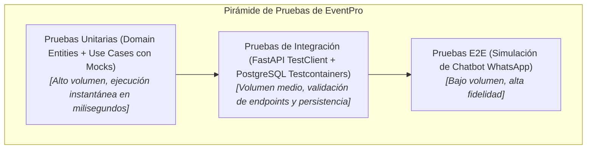

# 03. Gobernanza de Código, Git Workflow y Definition of Done (DoD)

---

## 1. Modelo de Ramas (Git Workflow)

EventPro adopta una variante ágil y estructurada de **GitHub Flow / GitFlow ligero**:

* `main`: Código en estado de producción. Únicamente recibe merges aprobados desde `develop` o hotfixes críticos.
* `develop`: Rama principal de integración y desarrollo activo.
* `feature/<modulo>-<descripcion>`: Ramas para nuevas funcionalidades (ej. `feature/m03-mobility-calculator`, `feature/m06-contract-pdf-generator`).
* `fix/<modulo>-<descripcion>`: Correcciones de bugs identificados en fase de pruebas.
* `hotfix/<descripcion>`: Correcciones urgentes aplicadas directamente sobre `main`.

---

## 2. Convención de Mensajes de Commit (Conventional Commits)

Todos los commits deben cumplir con el estándar formal:
```text
<tipo>(<alcance_opcional>): <descripción_en_presente>

[cuerpo_opcional]

[referencia_a_requerimiento_opcional]
```

### Tipos Permitidos:
* `feat`: Nueva funcionalidad para el usuario o sistema (ej. `feat(quotes): implementar cálculo de movilidad con margen del 15%`).
* `fix`: Corrección de un defecto o error de lógica (ej. `fix(payments): corregir fórmula de saldo pendiente excluyendo adelanto`).
* `docs`: Cambios exclusivos en documentación (ej. `docs(architecture): actualizar diagramas C4 con Redis cache`).
* `refactor`: Refactorización de código sin alterar su comportamiento externo.
* `test`: Adición o corrección de pruebas automatizadas con `pytest`.
* `chore`: Mantenimiento de dependencias o scripts auxiliares.

---

## 3. Criterios de Aceptación: Definition of Done (DoD)

Para que una tarea o requerimiento funcional se considere formalmente **FINALIZADA (DONE)** y lista para mergear en la rama `develop`, debe satisfacer obligatoriamente la siguiente lista de verificación:

- [ ] **Cumplimiento de Requerimiento:** El código implementa con fidelidad la especificación del requerimiento funcional (`RF-XX`) y las reglas de negocio asociadas (`RN-XX`).
- [ ] **Aislamiento Hexagonal:** La lógica de negocio no contiene importaciones de frameworks web (FastAPI) ni detalles de persistencia (SQLAlchemy); se orquesta a través de puertos y casos de uso.
- [ ] **Tipado Estático Estricto:** Código verificado con análisis estático (`mypy app/`) sin advertencias ni tipos `Any` no justificados.
- [ ] **Calidad y Formato:** Código formateado y validado con `ruff` (`ruff check .` y `ruff format .`).
- [ ] **Cobertura de Pruebas Unitarias:**
  - 100% de cobertura en servicios de dominio y cálculos de cotización.
  - Coberura global mínima del 75% en la suite de `pytest`.
  - Todas las pruebas automatizadas pasan en verde (`pytest -v`).
- [ ] **Mocks para Servicios Externos:** Las pruebas de integración no realizan llamadas reales a Meta WhatsApp ni a Google Maps; utilizan adaptadores mock o stubs.
- [ ] **Migraciones de BD Actualizadas:** Si hubo cambios de esquema, se incluye la migración de Alembic con `upgrade()` y `downgrade()` funcionales.
- [ ] **Documentación OpenAPI y Logging:** Los endpoints exponen esquemas de Pydantic con descripciones y ejemplos; las operaciones críticas registran logs estructurados.

---

## 4. Estrategia de Pruebas Automatizadas



1. **Unitarias:** Prueban la lógica de `FinancialEngine`, `TravelIntervalService`, `Money` y Casos de Uso con repositorios en memoria.
2. **Integración:** Prueban los routers de FastAPI con `httpx.AsyncClient` sobre una base de datos PostgreSQL temporal y aislada.
3. **Resiliencia:** Verifican que si Google Maps o WhatsApp retornan error HTTP 500, la aplicación maneja el fallback adecuadamente sin caerse.
