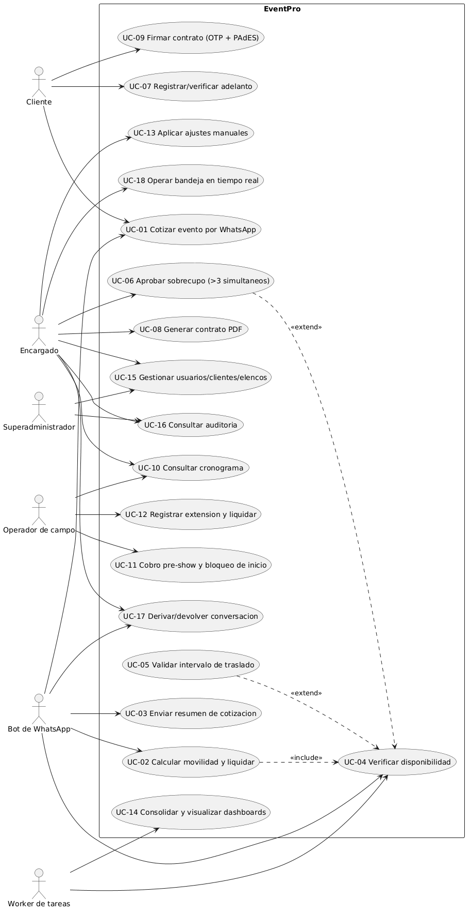
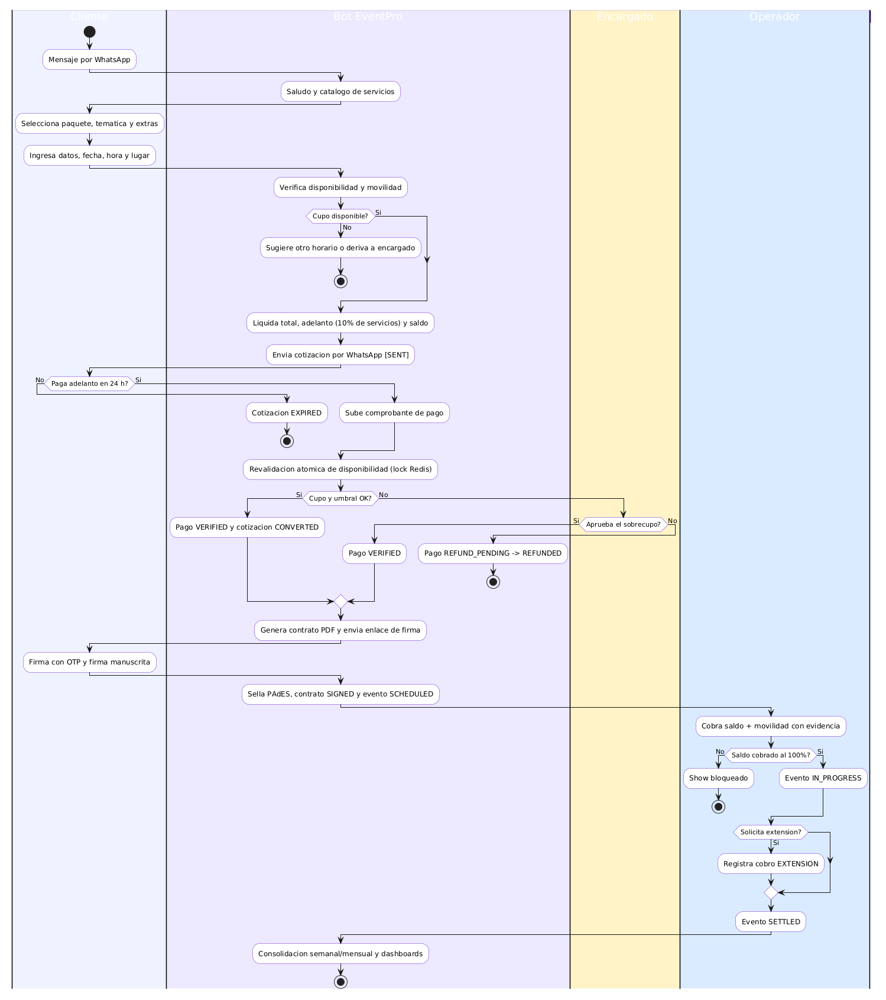
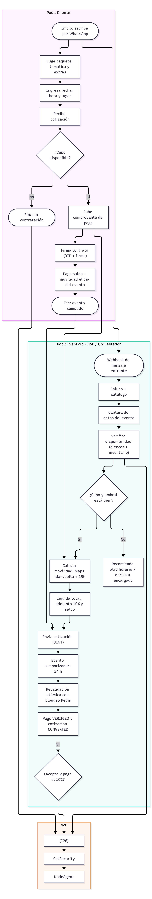
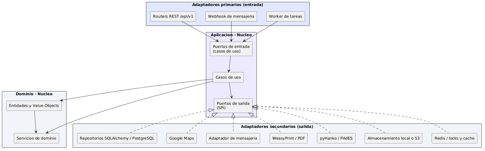
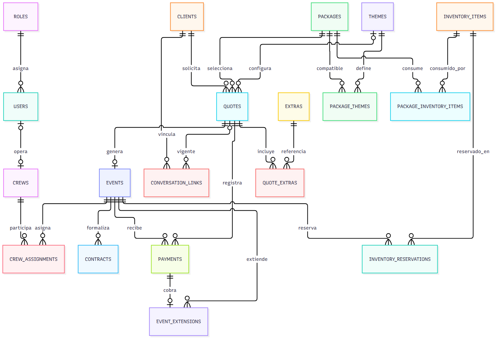

# EventPro — Diseño de la Solución

**Sistema:** EventPro — Automatización de cotizaciones por WhatsApp y control operativo para una promotora de eventos.
**Etapa:** 1 · Versión 1 — sección *Diseño de la solución*.
**Contenido:** Correcciones V1 · Casos de uso · Diagrama de actividad · BPMN TO-BE · Reglas ECA · Arquitectura · Base de datos y APIs/integraciones.

> **Nota de figuras:** los diagramas se insertan como imágenes almacenadas en esta misma carpeta (`01-casos-uso.png`, `02-diagrama-actividades.png`, `03-flujoBPMN-principal.png`, `04-arquitectura.png`, `05-er.png`). Los códigos fuente de cada figura se encuentran en `codigos-diagramas.md`.

---

## 1. Correcciones V1

Tras la revisión de la versión 1 se refinaron los catálogos de requerimientos funcionales y no funcionales. Las correcciones aplicadas son:

| # | Artefacto | Corrección aplicada |
| :--: | :--- | :--- |
| 1 | RNF | Se separó **calidad del software** (tipado estricto, lint, cobertura de pruebas) de **trazabilidad** (logs estructurados y bitácora), que estaban fusionadas en la V1. |
| 2 | RNF | Se incorporó **configurabilidad**: los parámetros de negocio (umbral de simultaneidad, plazos, porcentajes y márgenes) deben residir en variables de entorno, sin cambios de código. |
| 3 | RF-05 / RF-06 | Se precisó que la movilidad se calcula sobre el trayecto **ida y vuelta**, y que la exención por transporte propio fija el costo en **S/ 0.00**. |
| 4 | RF-07 | Se explicitó que el adelanto del 10 % se calcula **solo sobre servicios** (paquete + extras), excluyendo la movilidad. |
| 5 | RF-09 | Se reemplazó la noción de «agenda de bloques horarios» por **solape real de intervalos** de inicio y fin, donde el fin se calcula como el inicio más la duración del paquete. |
| 6 | RF-10 / RF-22 | Se unificó el intervalo de traslado como **tiempo de tránsito más margen de desarme y descanso (30 min)**, con ajuste manual auditable por parte del encargado. |
| 7 | RF-14 | El registro de observaciones del cliente se elevó a **campo estructurado persistente**, visible en el contrato PDF y en el cronograma. |
| 8 | RF-20 | Se aclaró que el sobrecupo es un **estado del pago**, no una bandera del evento. |
| 9 | RF-18 / RF-19 | Se precisó que el cobro in situ nace **verificado con auditoría posterior**, para no bloquear la operación el día del evento. |
| 10 | RNF-03 | Se incorporó explícitamente el **bloqueo distribuido** para la revalidación atómica de disponibilidad y la prevención de doble reserva. |

---

## 2. Casos de uso

### 2.1 Actores del sistema

| Actor | Tipo | Descripción |
| :--- | :--- | :--- |
| Cliente | Humano | Contrata el evento; interactúa por WhatsApp y firma el contrato mediante enlace público, sin credenciales de acceso al panel. |
| Encargado | Humano | Administra el catálogo, las cotizaciones, los contratos, los pagos, los ajustes manuales, las aprobaciones de sobrecupo y los reportes. |
| Operador de campo | Humano | Ejecuta el servicio en el lugar del evento: registra la llegada, el cobro del saldo con evidencia y las extensiones; solo visualiza sus eventos asignados. |
| Superadministrador | Humano | Configuración global, gestión de usuarios y roles, auditoría general y reasignación de conversaciones. |
| Bot de WhatsApp | Sistema | Ejecuta la cotización automática a través del gateway de mensajería. |
| Worker de tareas | Sistema | Ejecuta la expiración de cotizaciones, el despacho y reintento de mensajes, la reconciliación y la generación de reportes periódicos. |

### 2.2 Casos de uso principales

| Código | Caso de uso | Actor principal | Requerimientos |
| :--: | :--- | :--- | :--- |
| UC-01 | Cotizar evento por WhatsApp (saludo, catálogo, paquete, temática, extras y datos) | Bot | RF-01 a RF-04 |
| UC-02 | Calcular la movilidad y liquidar la cotización (total, adelanto y saldo) | Bot | RF-05 a RF-07 |
| UC-03 | Enviar el resumen de la cotización | Bot | RF-08 |
| UC-04 | Verificar la disponibilidad de recursos (inventario y elencos) | Bot / Sistema | RF-09 |
| UC-05 | Validar el intervalo de traslado entre shows | Sistema | RF-10 |
| UC-06 | Aprobar manualmente el sobrecupo por más de tres shows simultáneos | Encargado | RF-20 |
| UC-07 | Registrar y verificar el comprobante del adelanto | Cliente / Encargado | RF-11, RF-12 |
| UC-08 | Generar el contrato en PDF (automático o modo manual) | Sistema / Encargado | RF-13, RF-23 |
| UC-09 | Firmar electrónicamente el contrato (OTP y sello PAdES) | Cliente | RF-15 |
| UC-10 | Consultar el cronograma con observaciones | Encargado / Operador | RF-16, RF-17 |
| UC-11 | Registrar el cobro pre-show y bloquear el inicio del show | Operador | RF-18 |
| UC-12 | Registrar extensiones y liquidar el evento | Operador | RF-19 |
| UC-13 | Aplicar ajustes manuales de movilidad y de intervalos de traslado | Encargado | RF-21, RF-22 |
| UC-14 | Consolidar ingresos y costos, y visualizar dashboards | Sistema / Encargado | RF-24, RF-25 |
| UC-15 | Gestionar usuarios, clientes y elencos | Superadministrador / Encargado | RF-26, RF-28, RF-29 |
| UC-16 | Consultar la bitácora de auditoría | Encargado / Superadministrador | RF-27 |
| UC-17 | Derivar la conversación a un encargado y devolverla al bot | Bot / Encargado | RF-30 |
| UC-18 | Operar la bandeja de conversaciones en tiempo real | Encargado | RF-31, RF-32 |

### 2.3 Diagrama general de casos de uso



**Figura 1.** Diagrama general de casos de uso. El Cliente participa en la cotización, el pago del adelanto y la firma del contrato. El Encargado cubre la operación administrativa (aprobaciones, contratos, ajustes manuales, bandeja). El Operador de campo se restringe a sus eventos asignados. El Bot de WhatsApp y el Worker de tareas son actores de sistema que ejecutan los casos de uso automatizados.

---

## 3. Diagrama de actividad y BPMN TO-BE

### 3.1 Nota metodológica sobre la notación

| Necesidad | Herramienta | Motivo |
| :--- | :--- | :--- |
| Diagrama de actividad (UML) | PlantUML | Notación UML estándar con carriles, decisiones y flujos alternativos; es la representación correcta para este entregable. |
| BPMN TO-BE | Bizagi Modeler | BPMN 2.0 exige un modelo con pools, lanes y eventos de inicio/fin en su formato propio; es una herramienta gráfica de modelado. |
| Soporte visual en el documento | Mermaid | Permite renderizar flujos y diagramas entidad-relación de forma rápida y versionable. |

### 3.2 Diagrama de actividad — flujo principal automatizado



**Figura 2.** Diagrama de actividad del flujo principal, con los carriles **Cliente**, **Bot EventPro**, **Encargado** y **Operador**. El recorrido se describe a continuación:

1. El cliente envía un mensaje por WhatsApp; el bot responde con el saludo y el catálogo de servicios.
2. El cliente selecciona paquete, temática y extras, e ingresa los datos del evento: fecha, hora, lugar y observaciones.
3. El sistema verifica la disponibilidad de recursos (elencos e inventario) y calcula la movilidad con Google Maps (ida y vuelta, con margen comercial del 15 %). Si no hay cupo, se recomienda otro horario o se deriva a un encargado, sin revelar datos de pago.
4. El sistema liquida la cotización: total (servicios + movilidad), adelanto del 10 % de los servicios y saldo pendiente; envía el resumen y la cotización queda vigente por 24 horas.
5. Si el cliente paga el adelanto y sube el comprobante, el sistema ejecuta la revalidación atómica de disponibilidad bajo bloqueo distribuido.
6. Si el cupo está disponible y se respeta el umbral, el pago se marca como verificado y la cotización se convierte; en caso contrario, el encargado aprueba o rechaza el sobrecupo.
7. El sistema genera el contrato en PDF y envía el enlace de firma; el cliente firma mediante OTP y trazo manuscrito.
8. El sistema sella el documento con PAdES y el evento queda agendado en el cronograma con las observaciones visibles.
9. El día del evento, el operador cobra el saldo más la movilidad con evidencia; solo entonces el show inicia. Las extensiones de tiempo se registran como cobro adicional.
10. El evento se liquida y, de forma periódica, se consolida la información financiera para los dashboards.

### 3.3 BPMN TO-BE (proceso objetivo)



**Figura 3.** Proceso objetivo (TO-BE) modelado con pools y carriles. La estructura para modelar en Bizagi es:

| Pool | Carril | Responsabilidad principal |
| :--- | :--- | :--- |
| Cliente | — | Interés por WhatsApp, selección de opciones, provisión de datos, pago del adelanto, firma del contrato y pago final del saldo. |
| EventPro (automatizado) | Bot / Orquestador | Recpción del webhook, captura de datos, verificación de disponibilidad, cálculo de movilidad y liquidación, envío de la cotización, revalidación con bloqueo distribuido, generación del contrato, verificación de OTP, sellado PAdES y creación del evento en el cronograma. |
| EventPro (automatizado) | Servicios externos | Consulta de distancias y tiempos (Google Maps) y mensajería (gateway de WhatsApp). |
| EventPro (automatizado) | Encargado (panel) | Aprobación o rechazo del sobrecupo, ajustes manuales de movilidad e intervalos, emisión de contratos manuales, verificación y auditoría de pagos, atención de la bandeja de conversaciones. |
| EventPro (automatizado) | Operador de campo | Llegada a la locación, cobro del saldo con evidencia, control de inicio del show, registro de extensiones y cierre del evento. |
| EventPro (automatizado) | Finanzas y reportes | Consolidación semanal y mensual de ingresos contra costos fijos y generación de dashboards. |

**Compuertas de decisión (gateways) del proceso:**

| Compuerta | Tipo | Criterio de salida |
| :--- | :--- | :--- |
| Disponibilidad de recursos | Exclusiva | Cupo disponible → cálculo de movilidad; sin cupo → sugerencia de otro horario o derivación al encargado. |
| Provisión de movilidad | Inclusiva/Exclusiva | Cliente provee transporte → costo de movilidad igual a S/ 0.00. |
| Aceptación y vigencia de la cotización | Exclusiva | Acepta y paga en 24 h → flujo de pago; no → la cotización expira. |
| Revalidación atómica de disponibilidad | Exclusiva | Cupo y umbral correctos → pago verificado y creación del evento; umbral superado → aprobación manual; comprobante inválido → rechazo con reintento. |
| Cobro del saldo | Exclusiva | Saldo cobrado al 100 % con evidencia → inicio del show; caso contrario, el show permanece bloqueado. |
| Solicitud de extensión | Exclusiva | Con extensión → cobro adicional y transición a evento extendido; sin extensión → liquidación directa. |

**Eventos de inicio y fin:** inicio por mensaje de WhatsApp entrante; eventos intermedios temporales de vencimiento del plazo (24 horas) y de cierre semanal/mensual; fin normal con el evento liquidado y el reporte consolidado; fin alternativo con la cotización expirada o sin contratación.

---

## 4. Reglas ECA (Evento · Condición · Acción)

Se presentan las cuatro reglas de negocio más críticas del sistema. El catálogo completo se especifica en el documento de definición y análisis.

### ECA-C1 — Validación autoritativa del adelanto

| Elemento | Definición |
| :--- | :--- |
| **Evento** | El encargado aprueba el comprobante del adelanto, o aprueba un sobrecupo mediante el panel de control. |
| **Condición** | El pago corresponde al concepto de adelanto y se encuentra en estado de verificación pendiente; la revalidación de disponibilidad —ejecutada dentro de la sección crítica del bloqueo distribuido— confirma inventario, capacidad de elencos y umbral de simultaneidad. |
| **Acción** | El pago se marca como verificado, la cotización se convierte, se crea el evento en estado de pendiente de firma, se genera el contrato y se encola el enlace de firma para el cliente; la operación se registra en la bitácora de auditoría. |
| **Alternativa** | Si el cupo está lleno o se supera el umbral, el pago pasa a estado de aprobación manual y **no se crea el evento**. Si el comprobante es inválido, el pago se rechaza con motivo y se habilita el reintento. |
| **Invariante** | El cupo no puede confirmarse dos veces: la verificación y la escritura ocurren dentro de la misma sección crítica protegida por el bloqueo distribuido, garantizando la exclusión mutua entre procesos. |

### ECA-C2 — Umbral de shows simultáneos superado

| Elemento | Definición |
| :--- | :--- |
| **Evento** | Se incorpora un nuevo show con adelanto validado. |
| **Condición** | La cantidad de eventos cuyos intervalos se solapan realmente con el nuevo —contando solo los eventos con adelanto validado y no cancelados— supera el umbral configurable de tres shows simultáneos; es decir, el nuevo sería el cuarto simultáneo. |
| **Acción** | El pago se traslada al estado de aprobación manual y se notifica al encargado en su panel; no se crea el evento. El encargado aprueba el sobrecupo (el pago se verifica y se crea el evento) o lo rechaza (el pago pasa a devolución pendiente y luego a devuelto). |
| **Precisión** | Los intervalos contiguos no se solapan: si un show termina exactamente cuando empieza el siguiente, no se cuenta para el umbral. Las cotizaciones sin adelanto validado y los eventos cancelados tampoco se contabilizan. |

### ECA-C3 — Bloqueo del inicio del show sin saldo cobrado

| Elemento | Definición |
| :--- | :--- |
| **Evento** | El operador registra la llegada a la locación y el cobro in situ del saldo. |
| **Condición** | Se intenta iniciar el show sin que el 100 % del saldo pendiente (servicios más movilidad) esté registrado como pago verificado con evidencia obligatoria (medio de pago y fotografía). |
| **Acción** | El sistema bloquea la transición y exige completar el cobro con su evidencia. Al registrarlo, el pago nace verificado con estado de auditoría pendiente, el evento pasa a ejecución sin esperar al encargado y este lo audita después, confirmándolo o marcándolo como observado. |
| **Justificación** | Es un control no negociable: ningún show, armado de toldo ni ambientación inicia sin haber liquidado el saldo. La evidencia y la auditoría posterior sustituyen el bloqueo manual sin frenar la operación. |

### ECA-C4 — Firma electrónica y agendamiento del evento

| Elemento | Definición |
| :--- | :--- |
| **Evento** | El cliente abre el enlace de firma y confirma la firma con el código OTP y el trazo manuscrito. |
| **Condición** | El token de firma está vigente, no ha sido usado ni expirado; el código OTP de 6 dígitos es correcto y no superó el máximo de intentos; el contrato se encuentra emitido. |
| **Acción** | Se estampa la firma manuscrita en el PDF, se sella con firma electrónica PAdES (con marca de tiempo opcional), se registra el hash SHA-256 del documento sellado, la dirección IP, el agente de usuario y las marcas de tiempo en la bitácora; el contrato pasa a firmado y el evento se agenda en el cronograma con sus observaciones. |
| **Alternativa** | Si el OTP expira o se agotan los intentos, se rechaza la firma y se permite emitir uno nuevo sin invalidar el enlace; si el enlace expiró, el encargado puede reemitir el contrato. |
| **Invariante** | Solo puede existir un contrato no anulado por evento (índice único parcial), y el token de firma es de un solo uso. |

---

## 5. Arquitectura de la solución

### 5.1 Principio rector: Arquitectura Hexagonal

EventPro se diseña bajo el patrón de **Arquitectura Hexagonal (Puertos y Adaptadores)** propuesto por Alistair Cockurn. Su propósito es desacoplar las reglas de negocio de la infraestructura tecnológica, de modo que el núcleo del sistema sea independiente del framework, altamente testeable y sustituible.

La **regla de dependencia** es inviolable: las dependencias del código fuente apuntan únicamente hacia adentro, desde la infraestructura (adaptadores) hacia la aplicación (casos de uso y puertos) y desde allí hacia el dominio (entidades y objetos de valor). El dominio no importa FastAPI, SQLAlchemy ni clientes HTTP.



**Figura 4.** Arquitectura hexagonal de EventPro, con adaptadores primarios (entrada), núcleo de aplicación y dominio, y adaptadores secundarios (salida).

### 5.2 Capa de dominio

Núcleo puro del lenguaje, sin dependencias externas, que encapsula las invariantes de negocio:

| Elemento | Responsabilidad |
| :--- | :--- |
| Entidades | Cotización (agregado central con su máquina de estados), Evento, Contrato, Pago, Paquete, Temática, Extra, Ítem de inventario, Elenco y Usuario. |
| Objetos de valor | Importe monetario exacto (decimal, sin errores de coma flotante), ventana de tiempo con semántica de solape real, categoría de servicio, coordenadas y las enumeraciones estrictas de estado de cotización, pago, evento y contrato. |
| Servicios de dominio | Motor financiero (total, adelanto 10 %, saldo y rentabilidad); evaluador de concurrencia (umbral de shows simultáneos); servicio de intervalo de traslado (tránsito más margen de descanso, con ajuste manual); servicio de disponibilidad de inventario (stock disponible en la ventana solicitada). |
| Excepciones | Errores de validación, recursos duplicados, recursos en uso y categorías de servicio inválidas; la capa web los traduce a códigos HTTP. |

### 5.3 Puertos

**Puertos de entrada** — operaciones que ofrece el sistema:

| Puerto | Operaciones representativas |
| :--- | :--- |
| Casos de uso de cotización | crear cotización, calcular movilidad, liquidar, enviar resumen, cancelar, vencer. |
| Casos de uso de pagos | registrar adelanto, validar o rechazar comprobante, reembolsar, registrar cobro in situ, auditar. |
| Casos de uso de contratos | generar contrato PDF, emitir en modo manual, reenviar enlace, anular, firmar. |
| Casos de uso de eventos | agendar, consultar cronograma, asignar elencos, registrar llegada, cobrar saldo, registrar extensión, liquidar. |
| Casos de uso de ajustes manuales | ajustar movilidad, ajustar intervalo de traslado, aprobar o rechazar sobrecupo. |
| Casos de uso de conversaciones | traspasar, tomar, responder, devolver, reasignar, conciliar mensajes. |
| Casos de uso financieros | consolidar ingresos contra costos, generar dashboards. |

**Puertos de salida** — necesidades del sistema frente al exterior:

| Puerto | Implementación por defecto |
| :--- | :--- |
| Repositorios de cotizaciones, eventos, contratos, pagos, catálogo, elencos y usuarios | Repositorios SQLAlchemy sobre PostgreSQL. |
| Lectura del catálogo | Consulta para el bot y el motor de disponibilidad. |
| Verificación de disponibilidad | Inventario, umbral de simultaneidad y validación de tránsito. |
| Servicio de mapas | Distancias y tiempos (Google Maps Platform). |
| Mensajería | Envío y consulta de mensajes y conversaciones (gateway de WhatsApp). |
| Generación de PDF | Compilación de contratos (WeasyPrint con plantillas Jinja2). |
| Firma electrónica | Sellado PAdES, hash y marca de tiempo (pyHanko con certificado PKCS#12). |
| Almacenamiento de archivos | Comprobantes, fotografías de evidencia y contratos (almacenamiento local o S3). |
| Bloqueo y caché | Locks distribuidos y caché (Redis). |

### 5.4 Adaptadores

| Adaptador | Tipo | Función |
| :--- | :--- | :--- |
| Routers REST bajo `/api/v1` | Primario | Traducen HTTP a DTO, invocan los casos de uso y serializan las respuestas. |
| Webhook del gateway de mensajería | Primario | Valida la firma HMAC, garantiza idempotencia y encola eventos en el worker. |
| Worker de tareas programadas | Primario | Vencimiento de cotizaciones, despacho y reintentos de mensajes, reconciliación y reportes. |
| Repositorios SQLAlchemy | Secundario | Persistencia transaccional en PostgreSQL con acceso asíncrono. |
| Adaptador de Google Maps | Secundario | Cliente HTTP de distancias y tiempos de recorrido. |
| Adaptador de mensajería | Secundario | Aplicación API del gateway de WhatsApp (entrada y salida de mensajes). |
| Adaptador de documentos | Secundario | Renderizado HTML/Jinja2 a PDF, ejecutado fuera del ciclo de eventos. |
| Adaptador de firma | Secundario | Sellado PAdES y registro de metadatos criptográficos. |
| Adaptador de almacenamiento | Secundario | Guardado de evidencias y contratos. |
| Adaptador de bloqueo distribuido | Secundario | Adquisición y liberación segura de locks en Redis. |

### 5.5 Stack tecnológico e inyección de dependencias

- **Backend:** Python 3.12, FastAPI, Pydantic v2, Uvicorn y logs estructurados en JSON.
- **Datos:** PostgreSQL 16, SQLAlchemy 2.0 asíncrono, Alembic para migraciones y asyncpg.
- **Caché, bloqueos y cola de tareas:** Redis 7 con el framework de tareas arq.
- **Documentos y firma:** WeasyPrint con Jinja2 para PDF; pyHanko para firma PAdES con certificado PKCS#12.
- **Seguridad:** JWT, hashing Argon2id, límite de peticiones y validación real de tipo MIME.
- **Integraciones:** gateway de mensajería de WhatsApp (Chatwoot) y Google Maps Platform.
- **Inyección de dependencias:** se resuelve mediante el mecanismo nativo de FastAPI, donde cada caso de uso se instancia con las implementaciones concretas de sus puertos. En las pruebas se inyectan dobles en memoria; el dominio no distingue entre una base de datos real y un repositorio simulado.

---

## 6. Base de datos y APIs / integraciones

### 6.1 Entidades principales

| Entidad | Propósito | Campos clave |
| :--- | :--- | :--- |
| roles | Perfiles de acceso | código (superadministrador, encargado, operador), nombre. |
| users | Usuarios del panel | rol, correo y teléfono únicos, hash de contraseña, estado. |
| clients | Clientes finales (clave natural: teléfono) | teléfono E.164 único, nombre completo, DNI o RUC opcional. |
| packages | Catálogo de paquetes base | nombre, categoría de servicio, precio de venta, costo fijo, duración. |
| themes | Temáticas aplicables | nombre único, descripción, estado. |
| extras | Adicionales contratables | nombre, precio de venta, costo fijo, estado. |
| inventory_items | Inventario físico (toldos y decoración) | nombre único, categoría, stock total. |
| package_inventory_items | Inventario que consume cada paquete | paquete, ítem, cantidad por evento. |
| package_themes | Compatibilidad paquete–temática | paquete y temática (combinación única). |
| crews | Elencos freelance | operador vinculado, líder, teléfono, categoría de servicio. |
| crew_assignments | Asignación de elenco a evento | evento, elenco, intervalo de traslado aplicado, si fue ajustado manualmente. |
| inventory_reservations | Reserva de stock por evento y ventana | evento, ítem, cantidad, inicio y fin de la ventana, estado (activa o liberada). |
| quotes | Cotizaciones (agregado central) | cliente, origen, fecha y hora, ubicación, paquete y temática, montos de servicios, movilidad, total, adelanto, saldo, estado, vigencia. |
| quote_extras | Extras congelados de la cotización | cotización, extra, cantidad, precio unitario, subtotal. |
| events | Evento confirmado y operativo | código único, cotización origen, fecha, horarios, dirección, distrito, observaciones del cliente, estado. |
| contracts | Contrato PDF y firma electrónica | número correlativo, evento, ruta del PDF, hash del token de firma, hash del OTP, estado, hash del PDF sellado. |
| payments | Pagos: adelanto, saldo y extensión | cotización, evento, concepto, medio de pago, monto, ruta de evidencia, referencia, estado de validación, estado de auditoría. |
| event_extensions | Extensiones de tiempo en vivo | evento, pago asociado, minutos adicionales, tarifa pactada. |
| outbox_messages | Cola de mensajes salientes (patrón outbox) | destinatario, tipo, carga, estado, intentos, próximo intento. |
| audit_logs | Bitácora inmutable de acciones críticas | usuario, acción, entidad afectada, valores anteriores y posteriores, fecha. |
| conversation_links | Vínculo entre la conversación y el negocio | identificador de la conversación, cliente, cotización vigente, encargado asignado, motivo de derivación. |

**Convenciones del modelo:** claves primarias UUIDv4, montos en decimal de dos dígitos, marcas de tiempo en zona horaria UTC, códigos de estado en notación mayúscula con guion bajo bajo restricciones de verificación (no tipos enumerados nativos), para facilitar la evolución del esquema mediante migraciones.

### 6.2 Modelo entidad-relación



**Figura 5.** Diagrama entidad-relación. El agregado central es la cotización: nace de un cliente y un paquete, se convierte en un evento al validarse el adelanto y da origen al contrato y a los pagos. El evento se vincula con los elencos asignados y con las reservas de inventario.

### 6.3 Endpoints de la API REST

La API expone un prefijo base `/api/v1` (excepto el endpoint de salud), autenticación con token JWT y control de acceso por roles (RBAC). Convenciones de respuesta: 200/201/204 para éxitos, 400/409/422 para errores de negocio y validación, 401/403 para autenticación y autorización, y 404 para recursos inexistentes o fuera de alcance del usuario.

| Módulo | Endpoints | Roles | Descripción |
| :--- | :--- | :--- | :--- |
| Salud | `GET /health` | Público | Estado de la base de datos y la caché. |
| Autenticación | `POST /auth/login`, `/refresh`, `/logout` | Público / JWT | Sesión con token de acceso y token de refresco rotativo. |
| Usuarios | `GET/POST /users`, `GET/PATCH /users/{id}` | Superadministrador | Alta, edición, roles y desactivación. |
| Catálogo | Lectura y escritura de `/catalog/packages`, `/catalog/themes`, `/catalog/extras`, `/catalog/inventory-items`, más reemplazo de inventario y temáticas por paquete | Público (lectura) / Encargado y Superadministrador (escritura) | Administración del catálogo con baja lógica. |
| Elencos | `GET/POST /crews`, `PATCH /crews/{id}` | Encargado y Superadministrador | Gestión y vinculación con usuario operador. |
| Cotizaciones | `POST/GET /quotes`, `GET /quotes/{id}`, `POST /quotes/{id}/cancel`, `POST /quotes/{id}/pay-advance` | Encargado y Superadministrador | Cotizador con disponibilidad, liquidación y datos de pago. |
| Clientes | `GET /clients`, `GET /clients/{id}` | Encargado y Superadministrador | Búsqueda y ficha (no accesible al operador). |
| Pagos | `POST /payments/advance`, `GET /payments`, `GET /payments/{id}`, `GET /payments/{id}/evidence`, `PATCH /payments/{id}/verify`, `/audit`, `/refund` | Encargado y Superadministrador | Registro, verificación con revalidación atómica, auditoría de cobros in situ y reembolso. |
| Eventos | `GET /events/schedule`, `GET /events/{id}`, `POST /events/{id}/crew-assignments`, `POST /events/{id}/arrive`, `/check-in-and-collect`, `/extensions`, `/settle`, `/cancel` | Encargado y Superadministrador; Operador (solo eventos propios) | Cronograma y operación en campo. |
| Contratos | `GET /contracts`, `GET /contracts/{id}`, `GET /contracts/{id}/pdf`, `POST /contracts/manual`, `POST /contracts/{id}/resend-link`, `POST /contracts/{id}/void` | Encargado y Superadministrador | Consulta, modo manual, reenvío y anulación. |
| Firma electrónica | `GET /contracts/sign/{token}`, `GET /contracts/sign/{token}/pdf`, `POST /contracts/sign/{token}/otp`, `/verify-otp`, `/sign` | Cliente (token de un solo uso) | Página pública de firma: ver el contrato, recibir OTP, verificar y firmar. |
| Ajustes manuales | `PATCH /overrides/quotes/{id}/mobility`, `PATCH /overrides/crew-assignments/{id}/transit-interval`, `POST /overrides/payments/{id}/approve-simultaneous` | Encargado y Superadministrador | Overrides auditables y aprobación de sobrecupo. |
| Conversaciones | `GET /conversations`, `GET /conversations/{id}/messages`, `GET /conversations/{id}/attachments/{id}`, `POST /conversations/{id}/takeover`, `/release`, `POST /conversations/{id}/messages`, `GET /conversations/stream` | Encargado y Superadministrador | Bandeja, hilo, toma y devolución, envío y actualización en tiempo real. |
| Reportes | `GET /reports/dashboard`, `GET /reports/financial/pnl` | Encargado y Superadministrador | Indicadores y estado de resultados. |
| Webhooks | `POST /webhooks/chatwoot` | Interno (firma HMAC) | Entrada de mensajes del gateway de mensajería. |

### 6.4 Ejemplo de request y response

Caso: **crear una cotización**. El cálculo de la movilidad y la liquidación se realiza en el servidor, previa verificación de disponibilidad.

`POST /api/v1/quotes`

```json
{
  "client": {
    "phone": "+51999888777",
    "full_name": "Carlos Rodríguez",
    "dni": null,
    "ruc": null
  },
  "event_date": "2026-10-15",
  "event_time": "21:30:00",
  "location_address": "Av. Benavides 2150",
  "location_district": "Miraflores",
  "package_id": "e4b2d5a1-...",
  "theme_id": "t1-...",
  "extras": [{"extra_id": "x1-...", "quantity": 1}],
  "client_provides_mobility": false
}
```

**201 Created**

```json
{
  "quote_id": "q9c8a1b2-...",
  "client_id": "c1-...",
  "source": "WHATSAPP",
  "availability": "AVAILABLE",
  "services_subtotal": 1000.00,
  "calculated_distance_km": 18.40,
  "calculated_transit_minutes": 55,
  "final_mobility_amount": 80.50,
  "total_amount": 1080.50,
  "advance_amount": 100.00,
  "pending_balance": 980.50,
  "breakdown": {
    "services_balance_due": 900.00,
    "mobility_due": 80.50
  },
  "status": "SENT",
  "sent_at": "2026-09-23T20:15:00Z",
  "expires_at": "2026-09-24T20:15:00Z"
}
```

Los errores de negocio se reportan con el código 409 (conflicto de disponibilidad o umbral de simultaneidad superado) y 422 (errores de validación como fecha pasada, temática incompatible o teléfono en formato inválido).

Caso: **verificar el comprobante del adelanto**. Dispara la revalidación autoritativa de disponibilidad bajo bloqueo distribuido; si el cupo está lleno, no se crea el evento.

`PATCH /api/v1/payments/{id}/verify`

```json
{
  "status": "VERIFIED",
  "rejection_reason": null
}
```

**200 OK**

```json
{
  "payment_id": "pay-11a2...",
  "validation_status": "VERIFIED",
  "event_created_id": "evt-77a8...",
  "contract_status": "ISSUED"
}
```

Si la revalidación detecta que el cupo está lleno, el estado de validación pasa a aprobación manual, los campos de evento y contrato son nulos y se informa la causa (conflicto de cupo o umbral superado). Para rechazar el comprobante se envía el motivo obligatorio, y el sistema notifica al cliente para que realice un nuevo intento.

### 6.5 Integraciones

| Integración | Protocolo | Uso en el sistema |
| :--- | :--- | :--- |
| Gateway de mensajería (Chatwoot) | REST interno y webhook firmado con HMAC-SHA256 | Bot y bandeja humana; el cliente nunca interactúa con esta herramienta. |
| WhatsApp Cloud API v20 | A través del gateway | Canal único de conversación con el cliente. |
| Google Maps Platform | REST (distancias y tiempos) | Cálculo de la movilidad y de los intervalos de traslado entre shows. |
| WeasyPrint con Jinja2 | Biblioteca local | Compilación del contrato PDF desde plantilla. |
| pyHanko con certificado PKCS#12 | Biblioteca local | Sellado PAdES y verificación de firma (marca de tiempo opcional). |
| Almacenamiento | Local o S3 | Comprobantes, fotografías de evidencia y contratos. |
| Redis | Protocolo Redis | Caché, cola de tareas y bloqueos distribuidos de disponibilidad. |

### 6.6 Seguridad

- **Autenticación:** token JWT con vigencia corta y token de refresco rotativo; el token de refresco se almacena como hash SHA-256.
- **Autorización por roles (RBAC):** superadministrador con acceso total; encargado con operación y gestión; operador restringido a sus eventos asignados (los demás responden 404 para no revelar su existencia); cliente con token de firma de un solo uso.
- **Protección de datos:** los costos directos y los datos personales no se exponen al operador ni en consultas públicas; los archivos se sirven a través de la API con control de acceso, nunca mediante rutas del sistema de archivos.
- **Endurecimiento:** límite de peticiones, validación real de tipo MIME para subidas, cumplimiento de la guía OWASP, webhook con validación de firma y ventana temporal, e idempotencia de eventos entrantes.
- **Trazabilidad:** bitácora de solo lectura para los ajustes manuales, las aprobaciones de sobrecupo, la auditoría de cobros, los contratos manuales y las firmas, con el hash del documento sellado.
