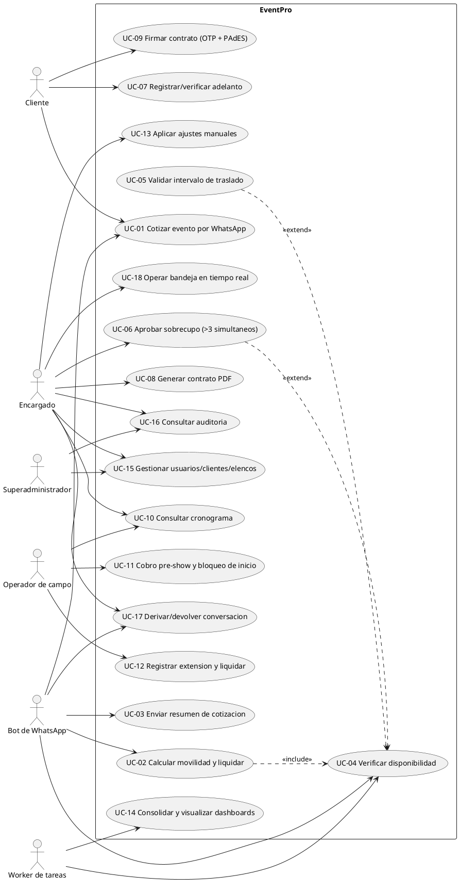
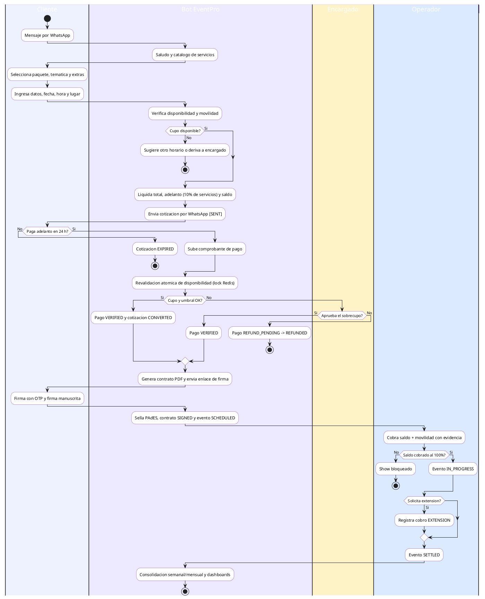
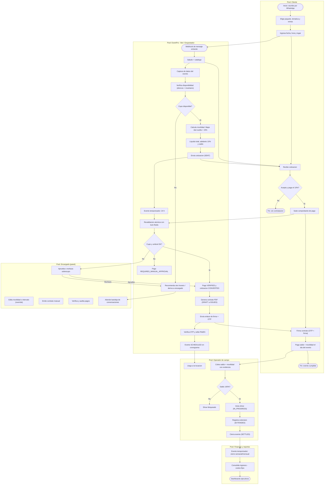
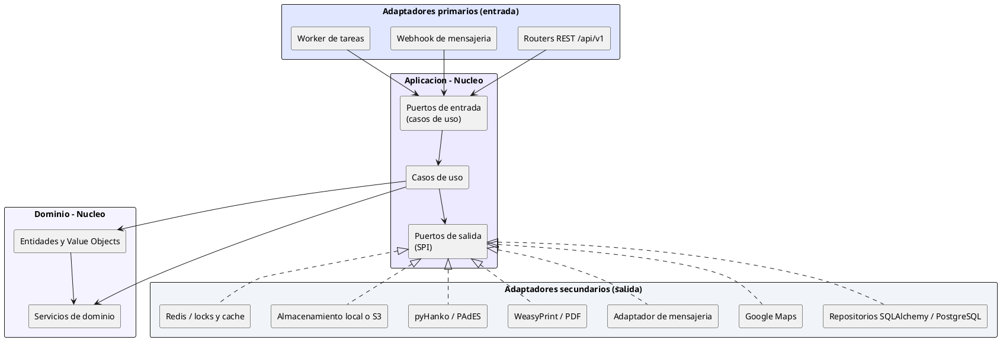
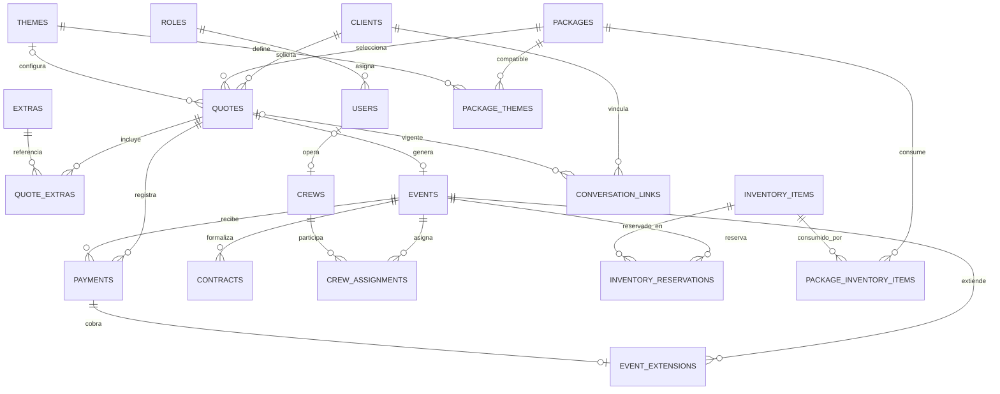

# Códigos fuente de los diagramas — Diseño de la solución (EventPro)

Estos códigos generan las figuras que se insertan en `02-diseno-de-solucion.md`.
Cada figura se renderiza y se guarda como imagen en `figuras/` con el nombre indicado.

## Instrucciones de renderizado

| Figura | Herramienta recomendada | Exportar a |
| :--- | :--- | :--- |
| 01 · Casos de uso (PlantUML) | <https://www.plantuml.com/plantuml/uml> o extensión PlantUML de VS Code | `figuras/01-casos-de-uso.png` |
| 02 · Diagrama de actividad (PlantUML) | Ídem | `figuras/02-diagrama-actividad.png` |
| 03 · BPMN TO-BE | Bizagi Modeler (modelado con los carriles indicados) o <https://mermaid.live> como apoyo | `figuras/03-bpmn-to-be.png` |
| 04 · Arquitectura hexagonal (PlantUML) | <https://www.plantuml.com/plantuml/uml> | `figuras/04-arquitectura.png` |
| 05 · Entidad-relación (Mermaid) | <https://mermaid.live> o extensión Markdown Preview Mermaid de VS Code | `figuras/05-er.png` |

---

## Figura 1 — Diagrama general de casos de uso (PlantUML)

---

## Figura 2 — Diagrama de actividad (PlantUML)

---

## Figura 3 — BPMN TO-BE (Mermaid de apoyo / estructura para Bizagi)

En Bizagi, crear **5 carriles** (Cliente, Bot/Orquestador, Encargado, Operador de campo, Finanzas y reportes) y modelar las tareas y compuertas descritas en `02-diseno-de-solucion.md`, sección 3.3. Como apoyo visual se puede usar el siguiente diagrama:

---

## Figura 4 — Arquitectura hexagonal (PlantUML)

---

## Figura 5 — Modelo entidad-relación (Mermaid)

